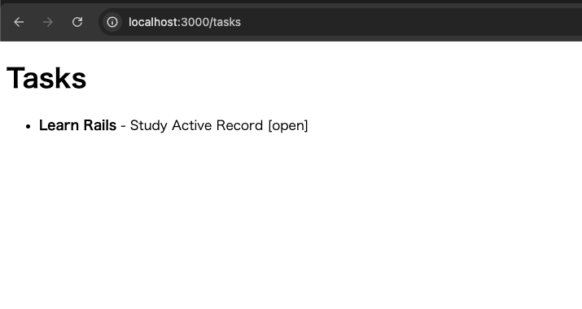
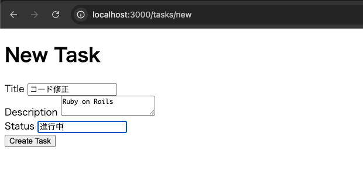
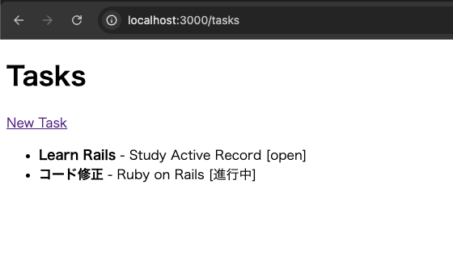
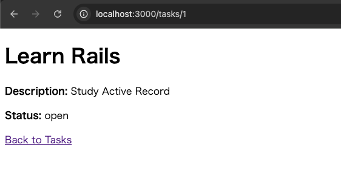
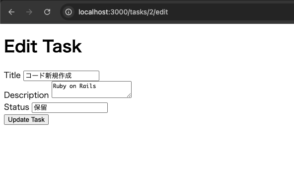
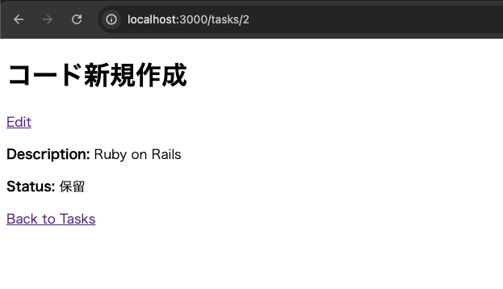
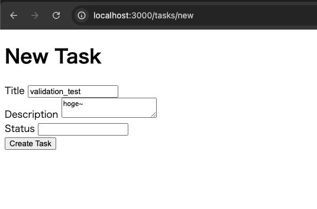
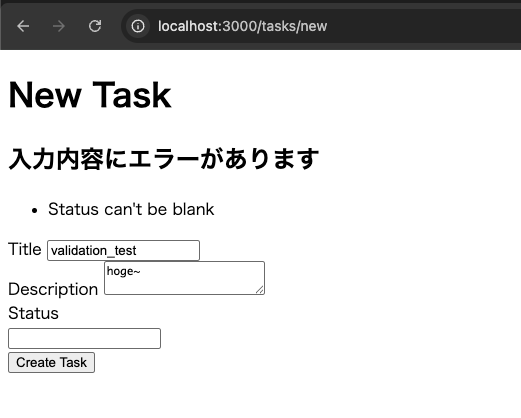

# Ruby on Rails 基礎

## 概要

Ruby on Rails の基本構造を理解するため、Task 管理アプリケーションを実装した

ハンズオン形式で実装を進め、  
HTTP リクエストが Rails 内部をどのように流れ、PostgreSQL に保存されたデータがブラウザへ表示されるかを確認する

---

## 実装内容

- Ruby / Rails 開発環境の構築
- Puma によるローカルサーバー起動
- Routing
- Controller / Action
- ERB View
- Controller から View へのデータ受け渡し
- Task Model
- Migration
- Active Record
- PostgreSQL
- CRUD
- Validation

---

## Rails の基本構成

Rails では主に以下の流れで HTTP リクエストを処理する

```text
Browser
  ↓
Puma
  ↓
Routing
  ↓
Controller
  ↓
Model
  ↓
Active Record
  ↓
PostgreSQL
  ↓
View
  ↓
HTTP Response
```

### Routing

`config/routes.rb` で、HTTP メソッドと URL を Controller / Action に紐付ける

```ruby
get "/tasks", to: "tasks#index"
get "/tasks/:id", to: "tasks#show"
post "/tasks", to: "tasks#create"
patch "/tasks/:id", to: "tasks#update"
delete "/tasks/:id", to: "tasks#destroy"
```

---

## Controller / View

Controller はリクエストに対する処理を実行し、View に渡すデータを準備する

```ruby
def index
  @tasks = Task.all
end
```

View では Controller のインスタンス変数を参照できる

```erb
<% @tasks.each do |task| %>
  <%= task.title %>
<% end %>
```

ERB では `<% %>` と `<%= %>` を使い分ける

### Ruby の処理だけを実行する

```erb
<% @tasks.each do |task| %>
  ...
<% end %>
```

`<% %>` は Ruby の処理を実行するが、その処理結果自体は HTML に出力しない

### Ruby の評価結果を HTML に出力する

```erb
<%= task.title %>
```

`<%= %>` は Ruby の式を評価し、その結果を HTML に出力する

例えば task.title が "Learn Rails" の場合、画面には Learn Rails と表示される



---

## Model / Active Record / PostgreSQL

Task Model は以下のように定義した

```ruby
class Task < ApplicationRecord
end
```

Rails の命名規則により、

```text
Task
 ↓
tasks テーブル
```

として自動的に対応付けられる

Active Record を利用することで、SQL を直接記述せずに DB を操作できる

```ruby
Task.all
Task.find(1)
Task.new(...)
task.save
task.update(...)
task.destroy
```

例えば、

```ruby
Task.all
```

は内部的に以下のような SQL に変換される

```sql
SELECT * FROM tasks;
```

---

## Migration

Migration を利用して `tasks` テーブルを作成した

```ruby
create_table :tasks do |t|
  t.string :title
  t.text :description
  t.string :status

  t.timestamps
end
```

Migration 実行：

```bash
bin/rails db:migrate
```

これにより PostgreSQL に以下の構造が作成される

```text
tasks
├── id
├── title
├── description
├── status
├── created_at
└── updated_at
```

Migration は DB 構造を作成・変更するための仕組みであり、  
通常の Web リクエスト処理では直接使用されない

---

## CRUD

### Create

```text
GET /tasks/new
  ↓
入力フォーム
  ↓
POST /tasks
  ↓
TasksController#create
  ↓
Task.new(task_params)
  ↓
task.save
  ↓
INSERT
```

`Task.new` は Ruby 上に新しい Task オブジェクトを作成するだけで、  
この時点では DB には保存されない

```ruby
@task = Task.new(task_params)
```

`save` を実行することで PostgreSQL に保存される

```ruby
@task.save
```





---

### Read

一覧取得：

```ruby
Task.all
```


詳細取得：

```ruby
Task.find(params[:id])
```



URL の `:id` は `params[:id]` で取得できる

```text
GET /tasks/1
 ↓
params[:id] = "1"
 ↓
Task.find("1")
```

---

### Update

```text
GET /tasks/:id/edit
 ↓
編集フォーム
 ↓
PATCH /tasks/:id
 ↓
TasksController#update
 ↓
Task.find(params[:id])
 ↓
task.update(task_params)
 ↓
UPDATE
```

`PATCH` はリソースの一部を更新する HTTP メソッドとして利用する





---

### Delete

```text
DELETE /tasks/:id
 ↓
TasksController#destroy
 ↓
Task.find(params[:id])
 ↓
task.destroy
 ↓
DELETE
```

---

## Strong Parameters

フォームから送信された全ての値をそのまま DB に渡さず、受け付ける項目を明示する

```ruby
def task_params
  params.require(:task).permit(:title, :description, :status)
end
```

これは Validation ではなく、受け入れるパラメータを制限する仕組みである

---

## Validation

Task Model に Validation を追加した

```ruby
class Task < ApplicationRecord
  validates :title, presence: true
  validates :status, presence: true
end
```

Validation に失敗すると DB への INSERT / UPDATE は実行されない

Controller では保存結果を判定し、失敗時は入力画面を再表示する

```ruby
if @task.save
  redirect_to "/tasks"
else
  render :new, status: :unprocessable_entity
end
```

この場合、HTTP ステータスとして `422 Unprocessable Content` が返されることを確認した





---

## Rails ログによる処理確認

Rails のログから HTTP リクエスト、Controller、SQL、レスポンスの流れを確認できる

例：

```text
Started PATCH "/tasks/2"
Processing by TasksController#update

Task Load
SELECT ...

Task Update
UPDATE ...

Redirected to http://localhost:3000/tasks/2
Completed 302 Found
```

ログを見ることで、

```text
HTTP Request
 ↓
Controller
 ↓
Active Record
 ↓
SQL
 ↓
HTTP Response
```

のどこまで処理が進んでいるかを確認できる

SRE のトラブルシューティングでも重要な確認ポイントとなる

---

## 今回理解したこと

- Rails は Web アプリケーション全体を構築するためのフルスタックフレームワーク
- Puma が HTTP リクエストを受け付け、Rails に処理を渡す
- Routing が HTTP メソッド / URL と Controller / Action を紐付ける
- Controller は処理と View に渡すデータを管理する
- View は ERB を利用して HTML を生成する
- Model はアプリケーション上のデータ操作やルールを管理する
- Active Record が Model と PostgreSQL の間を仲介する
- Migration によって DB 構造をコードで管理できる
- Strong Parameters と Validation は異なる役割を持つ
- Rails のログから HTTP / SQL / レスポンスの処理フローを追跡できる

---

## 次のステップ

次のフェーズでは Rails アプリケーションを Docker コンテナ化し、AWS 上で動作させるための準備を進める

その後、Terraform を利用して ECS / ALB / RDS などの AWS インフラを構築する

---
