<!-- omit in toc -->
# ECS / Rails Observability

<!-- omit in toc -->
## 目次

- [1. 概要](#1-概要)
- [2. CloudWatch Dashboard](#2-cloudwatch-dashboard)
- [3. CloudWatch Logs](#3-cloudwatch-logs)
- [4. Slack 通知](#4-slack-通知)
- [5. Alarm](#5-alarm)
- [6. ELB 5XX と Target 5XX の切り分け](#6-elb-5xx-と-target-5xx-の切り分け)
- [7. 監視設計まとめ](#7-監視設計まとめ)
- [8. 今回の検証で確認できたこと](#8-今回の検証で確認できたこと)

---

## 1. 概要

Rails アプリケーションを稼働させている ECS / Fargate 環境に対して、  
CloudWatch を利用したモニタリングおよびアラート通知を構築する

本検証では、単にメトリクスを表示するだけではなく、  
実際に高負荷・Task 停止・アプリケーションエラーを発生させ、  
障害発生から Slack 通知までの一連の動作を確認する

### 監視構成

```text
Application Load Balancer
        │
        ▼
ECS / Fargate
        │
        ▼
RDS PostgreSQL

        │
        │ Metrics / Logs
        ▼
Amazon CloudWatch
├── Dashboard
├── Logs
└── Alarm
      │
      ▼
Amazon SNS
      │
      ▼
Amazon Q Developer
in chat applications
      │
      ▼
Slack
```

---

## 2. CloudWatch Dashboard

ALB → ECS → RDS の順番で確認できるように、  
CloudWatch Dashboard に主要メトリクスを集約する

### ALB

| メトリクス | 用途 |
|---|---|
| RequestCount | ALB が受け付けたリクエスト数 |
| TargetResponseTime | Target がレスポンスを返すまでの時間 |
| HTTPCode_ELB_5XX_Count | ALB 自身が生成した 5XX |
| HealthyHostCount | 正常な Target 数 |
| UnHealthyHostCount | 異常な Target 数 |

### ECS

| メトリクス | 用途 |
|---|---|
| CPUUtilization | ECS Service の CPU 使用率 |
| MemoryUtilization | ECS Service のメモリ使用率 |

### RDS

| メトリクス | 用途 |
|---|---|
| CPUUtilization | DB インスタンスの CPU 使用率 |
| DatabaseConnections | DB 接続数 |
| FreeableMemory | 利用可能メモリ |
| FreeStorageSpace | 利用可能ストレージ |

Dashboard の Period は `60 seconds` とし、  
短時間の Task 障害や負荷上昇についても変化を確認しやすくする

### 作成したダッシュボード

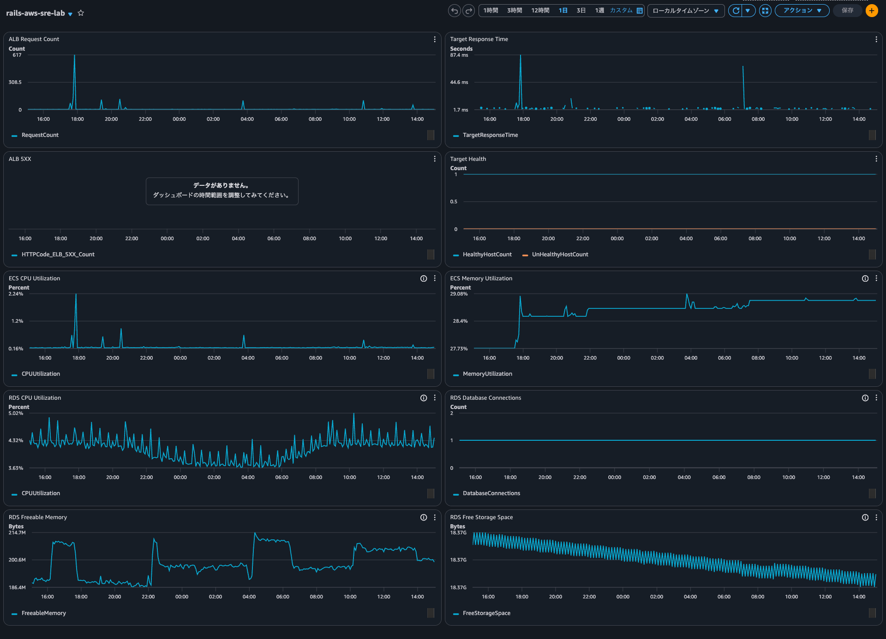

---

## 3. CloudWatch Logs

ECS Task のログは CloudWatch Logs に出力する

```text
ECS Task
  │
  │ awslogs
  ▼
CloudWatch Logs
  │
  ├── Rails Application Log
  ├── Puma Log
  └── Thruster Log
```

特定 Task の起動・停止やアプリケーションエラーを確認する場合は  
Log Stream を直接確認する

複数 Task / Log Stream を横断して調査する場合は、  
CloudWatch Logs Insights / Log Analytics を利用する

障害調査では、Dashboard / Alarm から異常箇所を絞り込み、  
CloudWatch Logs で詳細原因を調査する

```text
CloudWatch Alarm
        │
        ▼
Dashboard / Metrics
「どこで異常が起きているか」
        │
        ▼
CloudWatch Logs
「なぜ異常が起きたか」
```

---

## 4. Slack 通知

CloudWatch Alarm の通知先として SNS Topic を作成し、  
Amazon Q Developer in chat applications を経由して Slack へ通知する

```text
CloudWatch Alarm
      │
      ▼
SNS Topic
rails-aws-sre-lab-alerts
      │
      ▼
Amazon Q Developer
in chat applications
      │
      ▼
Slack
#rails-aws-sre-lab-alerts
```

SNS Topic は複数の Alarm から共通利用する

```text
ECS CPU Alarm ──────────┐
ALB 5XX Alarm ──────────┤
Target 5XX Alarm ───────┼── SNS ── Amazon Q ── Slack
Target Health Alarm ────┘
```

Slack Workspace の OAuth 認証は手動で実施する

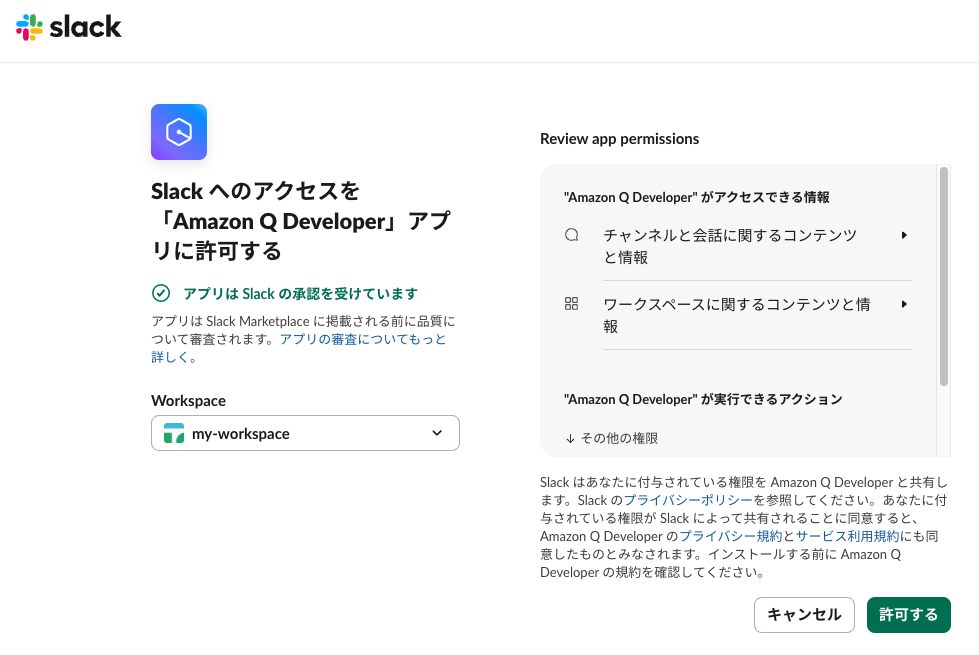

Channel Configuration、IAM Role、IAM Policy など、  
Terraform で管理可能なリソースについては Terraform に取り込む

---

## 5. Alarm

### 5.1 ECS CPU High

ECS Service の CPU 使用率を監視する

```text
AWS/ECS
CPUUtilization
```

通常設定：

```text
Statistic          : Average
Period             : 300 seconds
Evaluation Periods : 2
Threshold          : 80%
```

5 分平均 CPU 使用率が 80% を超える状態が  
2 データポイント連続した場合に ALARM とする

```text
CPU > 80%
    │
    ▼
CloudWatch Alarm
    │
    ▼
SNS
    │
    ▼
Amazon Q
    │
    ▼
Slack
```

### 負荷試験

`hey` を利用して ALB に対して負荷を発生させる

軽負荷：

```bash
hey -n 1000 -c 20 http://<ALB-DNS>/tasks
```

結果：

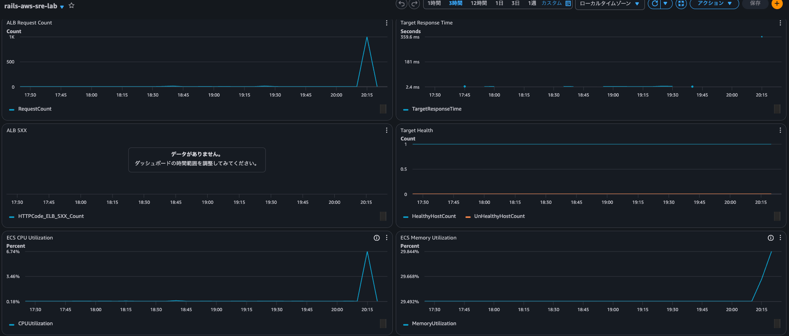

```text
Requests       : 1000
Concurrency    : 20
Requests/sec   : 約51
HTTP 200       : 1000
ECS CPU        : 約6.7%
```

この程度の負荷では CPU 使用率 80% には到達しなかったため、
さらに負荷を増加させる

```bash
hey -n 100000 -c 50 http://<ALB-DNS>/tasks
```

CPU 使用率が約 99% まで上昇することを確認した

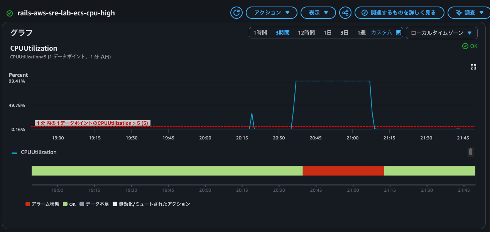

※ Alarm の E2E 試験ではアラーム条件を一時的に以下へ変更している

```text
Period             : 60 seconds
Evaluation Periods : 1
Threshold          : 5%
```

また、

- OK → アラーム状態
- アラーム状態 → OK
  
のように状態が遷移するタイミングで、Slack 通知が届くことを確認した

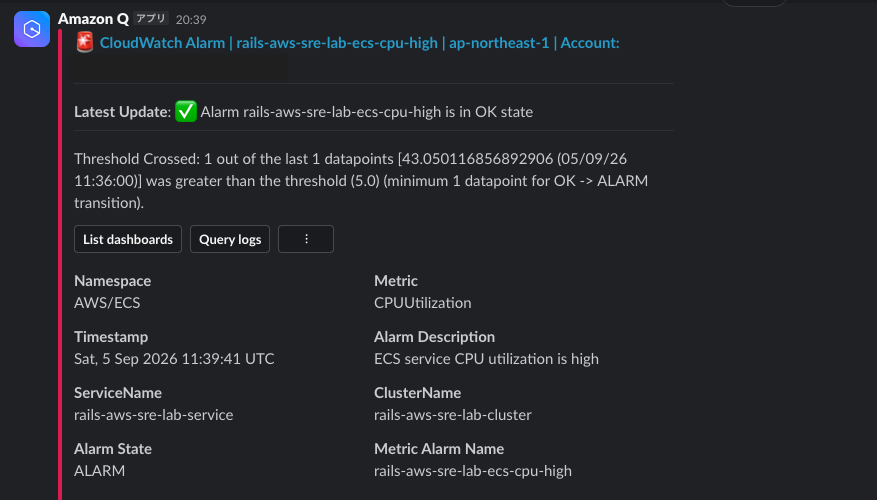

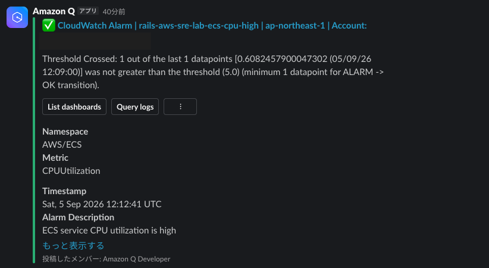

これにより、

```text
HTTP Request
    ↓
ALB
    ↓
Rails / ECS
    ↓
CPUUtilization 上昇
    ↓
CloudWatch Alarm
    ↓
SNS
    ↓
Amazon Q
    ↓
Slack
```

までの通知経路を確認した

---

### 5.2 ALB 5XX

ALB 自身が生成した 5XX を監視する

```text
AWS/ApplicationELB
HTTPCode_ELB_5XX_Count
```

設定：

```text
Statistic          : Sum
Period             : 60 seconds
Evaluation Periods : 1
Threshold          : >= 1
Missing Data       : notBreaching
```

`HTTPCode_ELB_5XX_Count` は、  
Target が返した 5XX ではなく **ALB 自身が生成した 5XX** を表す

例：

```text
Client
   ↓
ALB
   ↓
Healthy Target が存在しない
   ↓
ALB が Target へ転送できない
   ↓
503 Service Unavailable
   ↓
HTTPCode_ELB_5XX_Count
```

### 障害試験

ECS Service の `desired_count = 1` を維持したまま、
Running Task を手動停止する

同時にリクエストを継続して発生させる

```text
Request
   ↓
Task A
   ↓
Task A を Stop
   ↓
Healthy Target = 0
   ↓
ALB 5XX 発生
   ↓
ECS Service が Task B を起動
   ↓
Health Check 成功
   ↓
Healthy Target = 1
   ↓
復旧
```

このとき `HTTPCode_ELB_5XX_Count` が増加することを確認した

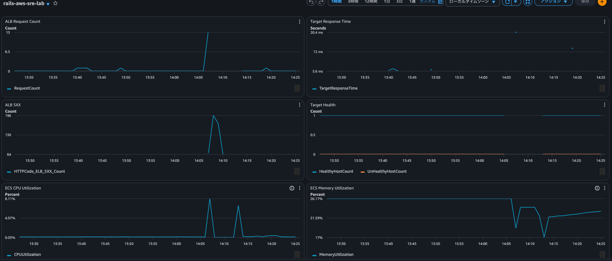

Slack に通知が届くことも確認できた

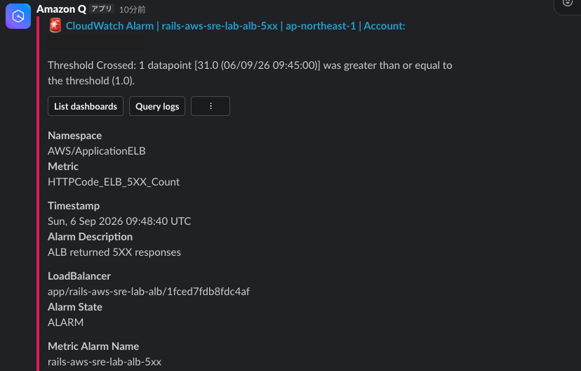

### Missing Data

5XX が存在しない場合、
`HTTPCode_ELB_5XX_Count = 0` が常に送信されるとは限らず、  
データポイント自体が存在しない場合がある

そのため以下を設定する

```hcl
treat_missing_data = "notBreaching"
```

これにより、5XX が発生していない期間の Missing Data は正常として扱う

Alarm の評価では過去の実データポイントが一定期間評価対象に残る場合があるため、  
最後の 5XX 発生から `OK` に戻るまで時間差が発生する場合がある

※ 今回は アラーム状態 → 5XX 発生なし → OK に戻るまでに、約10分掛かった

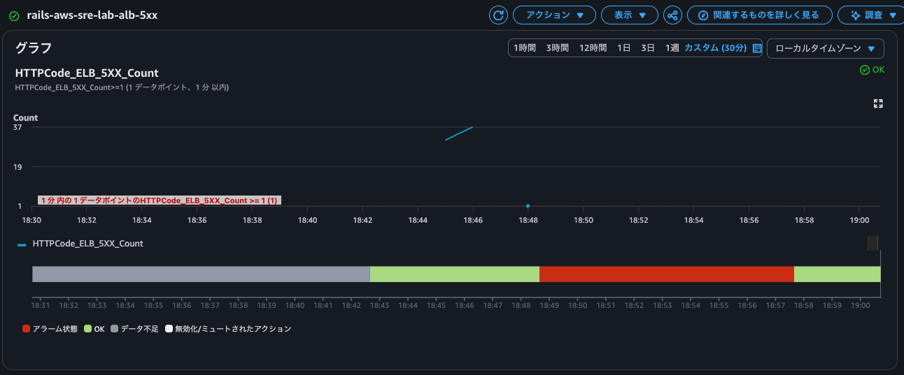

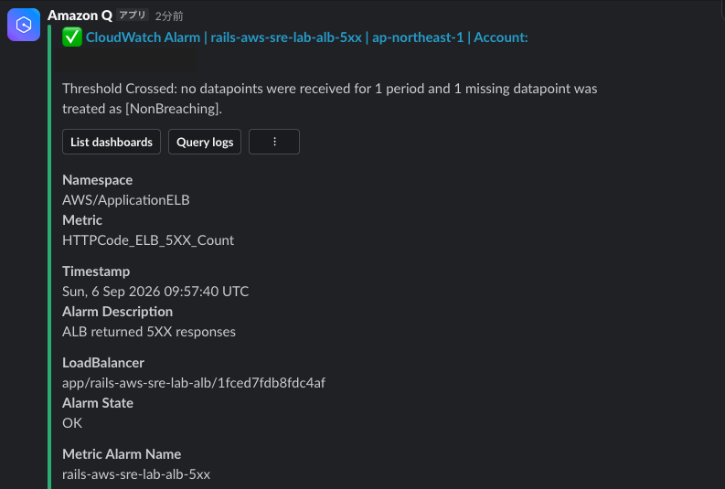

---

### 5.3 Target Health

ALB Target Group の正常 Target 数を監視する

```text
AWS/ApplicationELB
HealthyHostCount
```

設定：

```text
Statistic          : Minimum
Period             : 60 seconds
Evaluation Periods : 1
Threshold          : < 1
Missing Data       : breaching
```

現在の ECS Service は `desired_count = 1` のため、

```text
HealthyHostCount = 1
→ 正常

HealthyHostCount = 0
→ サービス提供可能な Target が存在しない
```

と判断できる

### 5XX Alarm との違い

ALB 5XX は、実際にクライアントからリクエストが発生しなければ、5XX 自体が発生しない

```text
Task停止
↓
Client Request = 0
↓
5XX = 0
```

そのため 5XX Alarm だけでは、  
アクセスがない時間帯の Target 障害を検知できない可能性がある

Target Health を併用することで、

```text
Client Request = 0
      ↓
Task停止
      ↓
Healthy Targetなし
      ↓
Target Health Alarm
      ↓
Slack
```

と可用性異常を検知することができる

### Missing Data

Target Health の監視では、
メトリクス自体が取得できない状態も異常として扱う

```hcl
treat_missing_data = "breaching"
```

実際の検証でも、

```text
no datapoints were received
↓
missing datapoint was treated as [Breaching]
↓
ALARM
```

となることを確認した

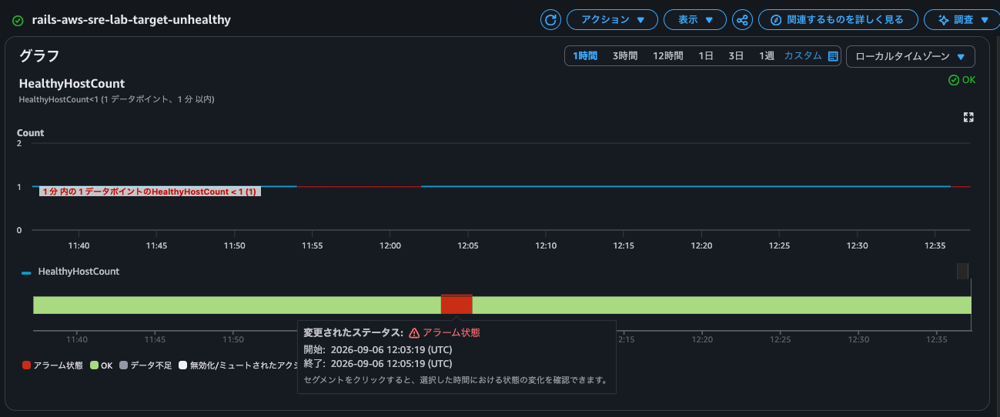

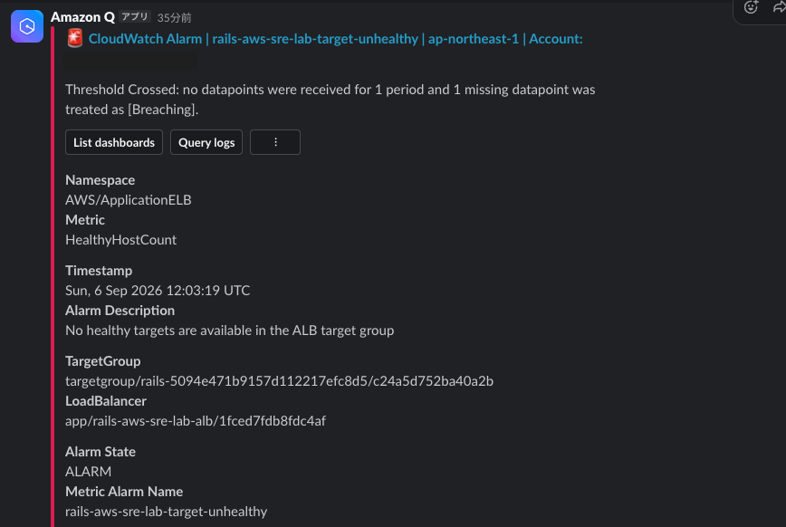

---

### 5.4 Target 5XX

Target が生成した 5XX を監視する

```text
AWS/ApplicationELB
HTTPCode_Target_5XX_Count
```

設定：

```text
Statistic          : Sum
Period             : 60 seconds
Evaluation Periods : 1
Threshold          : >= 1
Missing Data       : notBreaching
```

ALB 5XX との違いは、
**5XX を生成したコンポーネント**である

```text
HTTPCode_ELB_5XX_Count
→ ALB が生成した 5XX

HTTPCode_Target_5XX_Count
→ Rails / ECS など Target が生成した 5XX
```

### 障害試験

検証用エンドポイントを Rails に一時的に追加する

```ruby
get "/test-error", to: "hello#error"
```

Controller では意図的に例外を発生させる

```ruby
def error
  raise "Intentional test error"
end
```

アクセス：

```text
GET /test-error
```

処理：

```text
Client
   ↓
ALB
   ↓
Rails
   ↓
Intentional Exception
   ↓
HTTP 500
   ↓
HTTPCode_Target_5XX_Count
   ↓
CloudWatch Alarm
   ↓
Slack
```

`HTTPCode_Target_5XX_Count` の増加および
Slack 通知を確認した

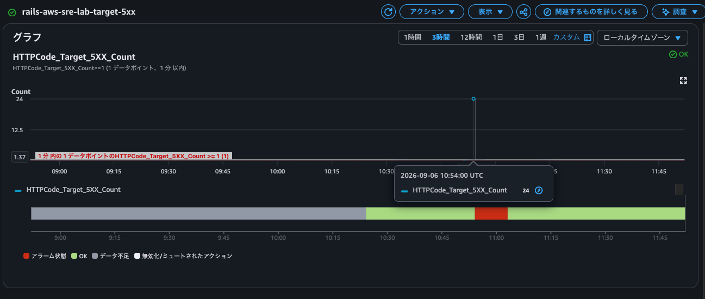

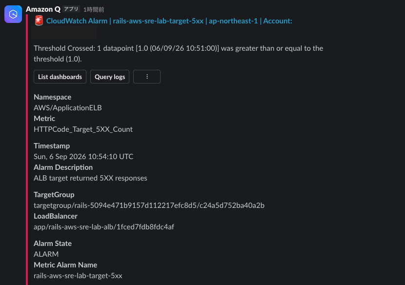

---

## 6. ELB 5XX と Target 5XX の切り分け

5XX の発生箇所によって確認するメトリクスを分ける

```text
                        Client
                           │
                           ▼
                    ┌──────────────┐
        ELB 5XX     │     ALB      │
      (ALB が生成)   └──────┬───────┘
                           │
                           │
                           ▼
                     ┌──────────────┐
                     │ ECS / Rails  │
                     └──────┬───────┘
                            │
                            └── Target 5XX
                               (Rails が生成)
```

| 状況 | ELB 5XX | Target 5XX | Target Health |
|---|---:|---:|---:|
| 正常 | - | - | Healthy |
| Rails が HTTP 500 | - | 増加 | Healthy |
| Healthy Target なし | 増加する可能性 | - | Unhealthy |
| Target 障害・アクセスなし | - | - | Unhealthy |

障害発生時は、これらのメトリクスを組み合わせて一次切り分けを行い、  
詳細原因は CloudWatch Logs で確認する

---

## 7. 監視設計まとめ

今回構築した監視は以下の役割を持つ

| 監視 | 検知対象 | 障害例 |
|---|---|---|
| ECS CPU | リソース逼迫 | 高負荷 |
| ECS Memory | リソース利用状況 | メモリ逼迫 |
| ALB RequestCount | トラフィック | 急増・減少 |
| TargetResponseTime | レスポンス性能 | 遅延 |
| ELB 5XX | ALB 側のリクエスト失敗 | Healthy Target なし |
| Target 5XX | アプリケーションエラー | Rails 500 |
| Target Health | Target の可用性 | Task停止 |
| RDS CPU | DB負荷 | クエリ負荷 |
| DB Connections | DB接続 | Connection増加 |
| FreeableMemory | DBメモリ | メモリ逼迫 |
| FreeStorageSpace | DBストレージ | 容量不足 |

障害調査時は以下の順番で確認する

```text
Slack Alarm
    ↓
CloudWatch Dashboard
    ↓
どのレイヤーで異常が発生しているか確認
    │
    ├── ALB
    ├── ECS
    └── RDS
    ↓
CloudWatch Logs
    ↓
アプリケーションログ / 起動ログを調査
    ↓
原因特定
```

---

## 8. 今回の検証で確認できたこと

- CloudWatch Dashboard に ALB / ECS / RDS の主要メトリクスを集約できる
- ECS の CPU / Memory 使用率を確認できる
- ALB の RequestCount / ResponseTime / 5XX / Target Health を確認できる
- RDS の CPU / Connections / Memory / Storage を確認できる
- CloudWatch Logs から Rails / ECS Task のログを調査できる
- `hey` による負荷試験で ECS CPU 使用率の上昇を確認できる
- ECS CPU Alarm から Slack まで E2E で通知できる
- ECS Task 停止時に ECS Service が自動的に Task を再作成する
- Healthy Target が存在しない場合に ALB 5XX が発生する
- Target Health Alarm によりアクセスがなくても Target 異常を検知できる
- Rails が生成した 500 は `HTTPCode_Target_5XX_Count` で検知できる
- ALB が生成した 5XX と Target が生成した 5XX をメトリクスから切り分けられる
- SNS Topic を共通化し、複数 Alarm を同じ Slack Channel へ通知できる
- Amazon Q Developer in chat applications の既存 IAM Role / Channel Configuration を `terraform import` で Terraform 管理へ取り込める

---
