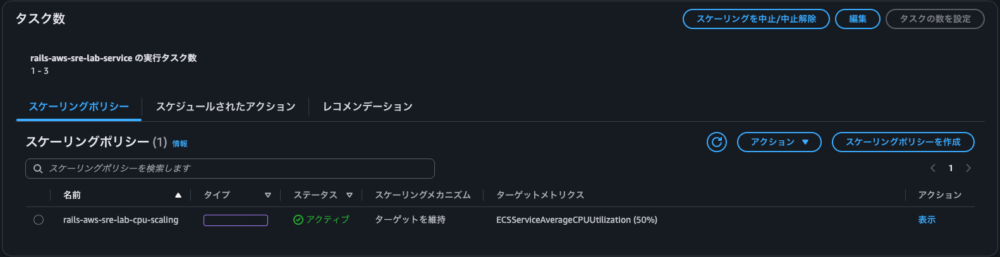
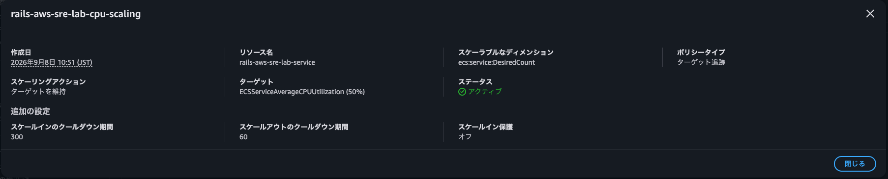
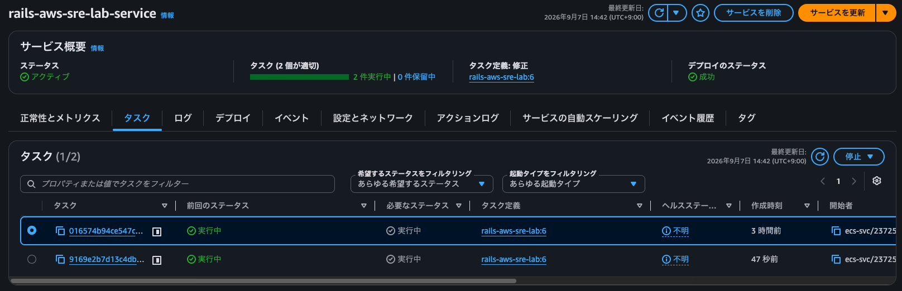
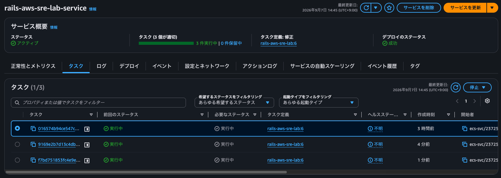
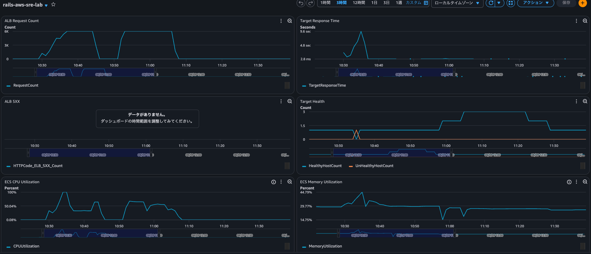
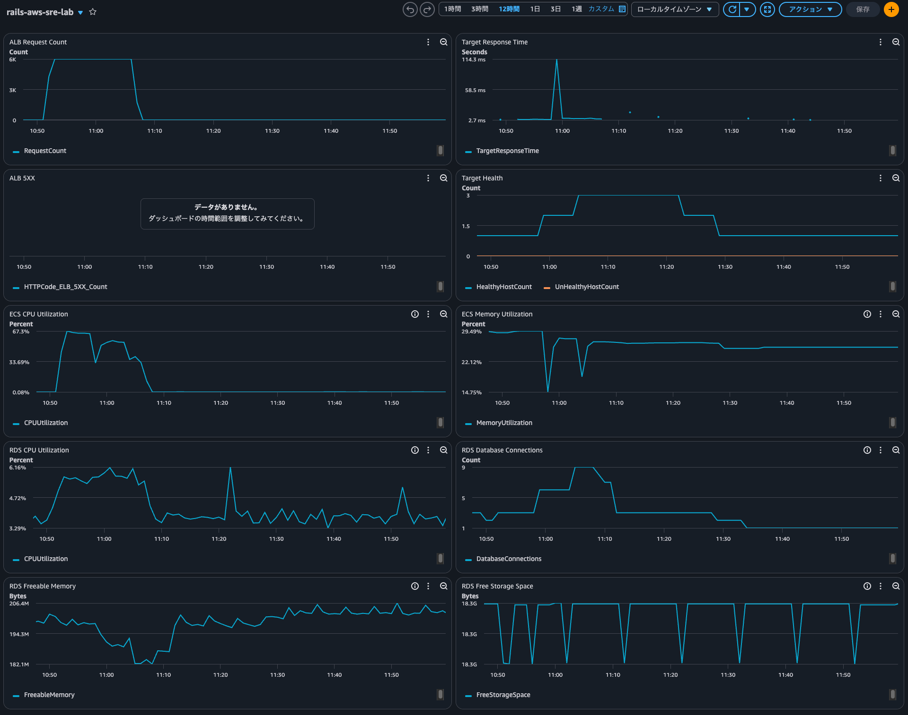
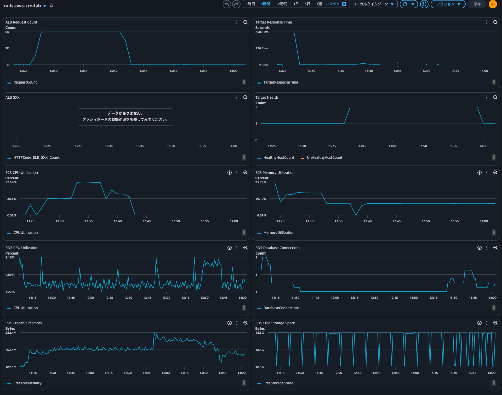

<!-- omit in toc -->
# ECS Fargate Right Sizing / Auto Scaling

<!-- omit in toc -->
## 目次

- [1. 概要](#1-概要)
- [2. 初期構成](#2-初期構成)
- [3. ECS Service Auto Scaling](#3-ecs-service-auto-scaling)
- [4. Auto Scaling 動作確認](#4-auto-scaling-動作確認)
- [5. 負荷試験](#5-負荷試験)
- [6. Auto Scaling OFF / ON 比較](#6-auto-scaling-off--on-比較)
- [7. Right Sizing](#7-right-sizing)
- [8. 256 CPU / 512 MiB](#8-256-cpu--512-mib)
- [9. 512 CPU / 1024 MiB](#9-512-cpu--1024-mib)
- [10. Target Response Time](#10-target-response-time)
- [11. コスト比較](#11-コスト比較)
- [12. 今後の予定](#12-今後の予定)

---

## 1. 概要

Rails アプリケーションを稼働させている ECS Fargate 環境に対して、以下を実施する

- ECS Service Auto Scaling の実装
- 負荷試験
- Auto Scaling 有無による性能比較
- Task の CPU / Memory サイズ変更による性能・コスト比較

---

## 2. 初期構成

検証開始時の ECS Task 設定は以下

```text
CPU    : 0.25 vCPU
Memory : 512 MiB
Task   : 1
```

ECS Service は `desired_count = 1` としている

```text
ALB
 ↓
ECS Service
 ↓
Fargate Task × 1
 ↓
Rails
 ↓
RDS PostgreSQL
```

---

## 3. ECS Service Auto Scaling

ECS Service の水平スケーリングには Application Auto Scaling を利用する

Terraform では以下を定義する

```text
ECS Service
   ↓
Application Auto Scaling
├── Scalable Target
└── Scaling Policy
```

---

### 3.1 Scalable Target

Task 数の最小値 / 最大値を定義する

```hcl
resource "aws_appautoscaling_target" "ecs" {
  min_capacity = 1
  max_capacity = 3

  resource_id        = "service/${aws_ecs_cluster.main.name}/${aws_ecs_service.rails.name}"
  scalable_dimension = "ecs:service:DesiredCount"
  service_namespace  = "ecs"
}
```

```text
Minimum Task Count : 1
Maximum Task Count : 3
```

---

### 3.2 Target Tracking Scaling

CPU 使用率を Target Metric として、  
ECS Service の平均 CPU 使用率を一定値付近に維持する

```hcl
resource "aws_appautoscaling_policy" "ecs_cpu" {
  name               = "rails-aws-sre-lab-cpu-scaling"
  policy_type        = "TargetTrackingScaling"
  resource_id        = aws_appautoscaling_target.ecs.resource_id
  scalable_dimension = aws_appautoscaling_target.ecs.scalable_dimension
  service_namespace  = aws_appautoscaling_target.ecs.service_namespace

  target_tracking_scaling_policy_configuration {
    target_value = 50.0

    predefined_metric_specification {
      predefined_metric_type = "ECSServiceAverageCPUUtilization"
    }

    scale_out_cooldown = 60
    scale_in_cooldown  = 300
  }
}
```

```text
Target CPU       : 50%
Scale Out        : 60 sec
Scale In         : 300 sec
Minimum Tasks    : 1
Maximum Tasks    : 3
```

Target Tracking は以下のような単純な閾値制御ではなく、

```text
CPU > 50%
→ 必ず +1 Task
```

ターゲットとなるメトリクスの目標値を実現する仕組みとなる

```text
ECS Service Average CPU Utilization
        ↓
Target 50%
        ↓
50%付近へ維持するよう
DesiredCountを自動調整
```





---

## 4. Auto Scaling 動作確認

負荷を発生させ、Task 数が自動的に増加することを確認する

CPU 使用率が上昇すると、

```text
Task 1
 ↓
CPU Utilization ↑
 ↓
Target Tracking
 ↓
Task 2
 ↓
さらに負荷継続
 ↓
Task 3
```

となることを確認した





負荷終了後は、Task が 1台になるまで Scale In することも確認した

---

## 5. 負荷試験

負荷試験には Vegeta を利用して、一定レートで負荷を与えた

```bash
echo "GET http://<ALB-DNS>/tasks" \
  | vegeta attack -rate=100/s -duration=15m \
  | vegeta report
```

```text
100 requests/sec
≈ 6,000 requests/min
```

今回は `hey` のようにサーバー性能に応じて実際の Request/sec が変化する方式ではなく、  
一定レートのリクエストを継続して発生させることで、
Auto Scaling ON / OFF の比較条件を揃えている

---

## 6. Auto Scaling OFF / ON 比較

同程度の負荷を与え、Auto Scaling 有無による挙動を比較する

---

### 6.1 Auto Scaling OFF

条件：

```text
CPU          : 256
Memory       : 512 MiB
Task         : 1
Auto Scaling : OFF
```

負荷：

```text
約 6,000 requests/min
```

結果：

```text
CPU Utilization
→ 最大ほぼ100%

HealthyHostCount
→ 一時的に 1 → 0

UnHealthyHostCount
→ 一時的に 0 → 1

TargetResponseTime
→ 最大数秒レベルまで悪化
```

CPU が飽和したタイミングで一時的に Target が Unhealthy になり、  
結果としてレスポンスタイムが大きく悪化することを確認した

```text
Request増加
 ↓
Task CPU飽和
 ↓
Response Time悪化
 ↓
Health Check応答遅延
 ↓
Target Unhealthy
```

※ 以下のダッシュボードのおおよそ 10:30 - 10:45 の範囲



---

### 6.2 Auto Scaling ON

条件：

```text
CPU          : 256
Memory       : 512 MiB
Task         : 1 - 3
Auto Scaling : ON
Target CPU   : 50%
```

同程度の負荷を与える

結果：

```text
Task
1 → 2 → 3

CPU Utilization
→ 50%前後へ収束

TargetResponseTime
→ 大きな悪化なし

Target Health
→ Healthyを維持
```

Target Tracking による Auto Scaling により負荷に応じて Task 数が増加し、  
ECS Service の平均 CPU 使用率が 50% 前後へ調整された

```text
Load
 ↓
CPU Utilization ↑
 ↓
Target Tracking
 ↓
DesiredCount ↑
 ↓
Task 1 → 2 → 3
 ↓
ALB Load Balancing
 ↓
CPU Utilization ↓
```

※ 以下のダッシュボードのおおよそ 10:50 - 11:05 の範囲


---

### 6.3 比較結果

| 項目 | Auto Scaling OFF | Auto Scaling ON |
|---|---|---|
| CPU | 256 | 256 |
| Memory | 512 MiB | 512 MiB |
| Task数 | 1 | 1 → 3 |
| CPU使用率 | 最大ほぼ100% | 約50%前後へ収束 |
| Response Time | 大幅悪化 | 安定 |
| Target Health | 一時Unhealthy | Healthy維持 |
| 負荷への追従 | 不可 | 自動Scale Out |

---

## 7. Right Sizing

続いて Task 1台あたりの CPU / Memory を変更し、
垂直スケーリングの効果を検証する

比較対象：

```text
Pattern A
CPU    : 256
Memory : 512 MiB

Pattern B
CPU    : 512
Memory : 1024 MiB
```

どちらも Auto Scaling は有効とする

```text
min_capacity = 1
max_capacity = 3
target CPU   = 50%
```

---

## 8. 256 CPU / 512 MiB

負荷試験結果：

```text
CPU
→ 約50 - 60%前後

Task
→ 最大3 Task

Memory
→ 約25 - 30%

TargetResponseTime
→ 大きな継続的悪化なし
```



---

## 9. 512 CPU / 1024 MiB

Task サイズを以下へ変更する

```text
CPU    : 512
Memory : 1024 MiB
```

同じ負荷を与える

結果：

```text
1 Task
→ CPU 約30%前後の区間あり

Scale Out後
→ 最大2 Task程度

CPU
→ 約30 - 40%前後

Memory
→ 十分な余裕あり
```

256 CPU 構成と比較して 1 Task あたりの処理能力が高く、  
少ない Task 数で同程度の負荷を処理できた



---

## 10. Target Response Time

負荷試験中、TargetResponseTime に一時的なスパイクを確認したが、  
一時的なもので最大250ms 程度のため、許容できると判断している

想定される要因：

- Rails / Puma の初回処理
- 新 Task 起動直後のウォームアップ
- DB Connection Pool の確立
- ALB Target 登録直後のアクセス
- キャッシュ未生成状態

---

## 11. コスト比較

Linux / ARM Fargate の料金を以下として比較する

```text
1 vCPU / hour = USD 0.04045
1 GB / hour   = USD 0.00442
```

---

### 11.1 256 CPU / 512 MiB × 3 Tasks

CPU：

```text
0.25 × 0.04045 × 3
= 0.0303375 USD/h
```

Memory：

```text
0.5 × 0.00442 × 3
= 0.00663 USD/h
```

合計：

```text
0.0369675 USD/h
≈ 0.0369 USD/h
```

---

### 11.2 512 CPU / 1024 MiB × 2 Tasks

CPU：

```text
0.5 × 0.04045 × 2
= 0.04045 USD/h
```

Memory：

```text
1 × 0.00442 × 2
= 0.00884 USD/h
```

合計：

```text
0.04929 USD/h
≈ 0.0493 USD/h
```

---

### 11.3 月額差

以下の条件で計算する

```text
10 hours / day
30 days / month
```

256 / 512：

```text
0.0369675 × 300
≈ 11.09 USD/month
```

512 / 1024：

```text
0.04929 × 300
≈ 14.79 USD/month
```

差額：

```text
約 3.70 USD/month
```

512 / 1024 構成は約 33% 高コストになる

ただし、本検証規模では月額差は数ドル程度である

---

## 12. 今後の予定

今後は以下を検証する

- Terraform Remote State
- CI/CD
- Application / Infrastructure Pipeline の分離
- GitHub Actions + AWS OIDC
- Staging / Production の環境分離
- Incident Simulation
- AWS インフラ構成レビュー
- Kiro を利用した既存 AWS リソースの Terraform 化

---
