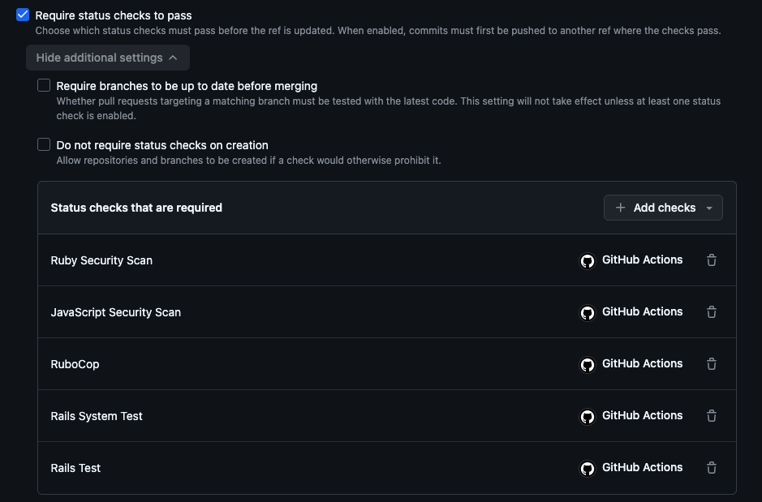
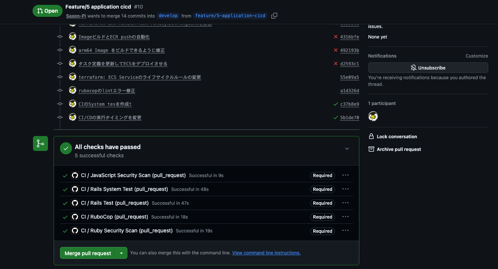

<!-- omit in toc -->
# Application CI/CD

<!-- omit in toc -->
## 目次
- [1. 概要](#1-概要)
- [2. CI/CD 全体構成](#2-cicd-全体構成)
- [3. CI](#3-ci)
- [4. CI のチェック項目](#4-ci-のチェック項目)
- [5. GitHub Ruleset](#5-github-ruleset)
- [6. AWS 認証](#6-aws-認証)
- [7. ARM64 Docker Image Build](#7-arm64-docker-image-build)
- [8. ECR Push](#8-ecr-push)
- [9. ECS Task Definition 更新](#9-ecs-task-definition-更新)
- [10. ECS Deploy](#10-ecs-deploy)
- [11. Terraform と Application CD の役割分担](#11-terraform-と-application-cd-の役割分担)
- [12. CI/CD 実行フロー](#12-cicd-実行フロー)
- [13. 最終 E2E 動作確認](#13-最終-e2e-動作確認)
- [まとめ](#まとめ)

---

## 1. 概要

Rails アプリケーションの変更に対して、  
GitHub Actions を利用した CI/CD パイプラインを構築する

-   Pull Request 作成・更新時に自動テストを実行する
-   CI が成功した変更のみ `develop` にマージできるようにする
-   `develop` へのマージ後、Docker Image を自動ビルドして Amazon ECR に Push する
-   新しい ECS Task Definition Revision を作成し、Amazon ECS に自動デプロイする
-   AWS の Access Key を GitHub に保存せず、OIDC で AWS 認証を行う

---

## 2. CI/CD 全体構成

``` text
feature branch
    |
    | Pull Request / Push
    v
GitHub Actions - CI
    |
    ┝─ Ruby Security Scan
    ┝─ JavaScript Security Scan
    ┝─ RuboCop
    ┝─ Rails Test
    ┝─ Rails System Test
    |
    v
GitHub Ruleset
    |
    | Required Status Checks がすべて成功
    v
develop に Merge
    |
    | push event
    v
GitHub Actions - CD
    |
    ┝─ GitHub OIDC -> AWS IAM Role
    ┝─ Docker Image Build (ARM64)
    ┝─ Amazon ECR Push
    ┝─ ECS Task Definition 更新
    ┝─ ECS Service Deploy
    |
    v
Amazon ECS / Fargate
```

CI と CD は別 Workflow とし、役割を分離する

-   `.github/workflows/ci.yml`
    -   Pull Request の品質チェックを担当
-   `.github/workflows/deploy.yml`
    -   `develop` に反映されたアプリケーションのデプロイを担当

---

## 3. CI

### 実行タイミング

`develop` などをマージ先とする Pull Request の作成・更新時に CI を実行する

Pull Request 作成後に feature branch に追加 Push した場合も、  
Pull Request の更新として CI が再実行される

feature branch への Push だけを理由に CD は実行しない

---

## 4. CI のチェック項目

### Ruby Security Scan

Ruby / Rails のセキュリティチェックを行う

主に以下を利用する

-   Brakeman
-   bundler-audit

Rails アプリケーションの脆弱なコードパターンや、依存 Gem の既知の脆弱性を検査する

### JavaScript Security Scan

Importmap で利用する JavaScript 依存関係を検査する

``` bash
bin/importmap audit
```

### RuboCop

Ruby コードの静的解析・Lint を行う

``` bash
bin/rubocop
```

### Rails Test

Rails の Unit / Model Test を実行する

Task Model では Validation のテストを追加し、  
必須項目が不足した Task が Validation Error になることを確認した

### Rails System Test

Capybara を利用して、ユーザー操作に近い形で Rails アプリケーションをテストする

※ 初期状態では `test/system/` が存在せず、CI で以下の LoadError が発生した

``` text
cannot load such file -- .../app/test/system (LoadError)
```

そのため、以下のコマンドで System Test を生成した

``` bash
bin/rails generate system_test tasks
```

生成された主なファイルは以下

``` text
test/application_system_test_case.rb
test/system/tasks_test.rb
```

Tasks 一覧画面へアクセスし、期待する HTML 要素が表示されることを確認するテストを作成した

``` ruby
class TasksTest < ApplicationSystemTestCase
  # 実際にブラウザ相当の操作で /tasks にアクセスして、画面上に <h1> が存在することを確認
  test "visiting the tasks index" do
    visit tasks_url

    assert_selector "h1"
  end
end
```

ローカル実行結果:

``` text
1 runs, 1 assertions, 0 failures, 0 errors, 0 skips
```

---

## 5. GitHub Ruleset

`main` / `develop` ブランチを保護するため、GitHub Ruleset を設定する

主なルール:

-   Pull Request を経由した変更を必須化
-   Branch deletion を禁止
-   Non-fast-forward update を禁止
-   Required Status Checks を設定

Required Status Checks:

``` text
Ruby Security Scan
JavaScript Security Scan
RuboCop
Rails Test
Rails System Test
```



これにより、  
CI が失敗している Pull Request は `develop` / `main` にマージできなくなる

``` text
Pull Request
     |
     v
    CI
     |
     ┝─ Failure -> Merge不可
     |
     └─ Success
            |
            v
         Merge可能
```

### CI 結果

CI の全 Required Check が成功し、  
Merge 可能になったことを GitHub Pull Request 画面で確認した



---

## 6. AWS 認証

GitHub Actions から AWS へアクセスする際、IAM User の長期 Access Key は使用せず、  
GitHub Actions の OIDC Token を利用して AWS STS から一時 Credential を取得する

``` text
GitHub Actions
      |
      | OIDC Token
      v
GitHub OIDC Provider
      |
      v
AWS STS
      |
      | AssumeRoleWithWebIdentity
      v
GitHub Actions Deploy IAM Role
      |
      v
AWS API
```

Deploy 用 IAM Role:

``` text
rails-aws-sre-lab-github-actions-deploy-role
```

GitHub Actions では以下の権限を有効にする (deploy.yml)

``` yaml
permissions:
  id-token: write
  contents: read
```

AWS Credential の取得には `aws-actions/configure-aws-credentials` を利用する

---

## 7. ARM64 Docker Image Build

ECS/Fargate の Task Definition では ARM64 を利用している

``` hcl
runtime_platform {
  operating_system_family = "LINUX"
  cpu_architecture        = "ARM64"
}
```

GitHub Hosted Runner は x86_64 のため、  
そのまま ARM64 Image をビルドすると以下のエラーが発生した

``` text
exec /bin/sh: exec format error
```

そのため GitHub Actions に QEMU / Docker Buildx を追加し、  
ARM64 Image をビルドできるようにした

``` text
GitHub Hosted Runner (x86_64)
        |
        v
QEMU + Docker Buildx
        |
        v
linux/arm64 Image
```

---

## 8. ECR Push

Docker Image のタグには `latest` ではなく Git Commit SHA を利用する

例:

``` text
rails-aws-sre-lab:d2593c1
```

これにより、ECS Task Definition と実際にデプロイされたソースコードの対応を追跡できる

また、ECR Repository は Immutable Tag を利用しているため、  
デプロイごとに新しい Git SHA Tag を作成する

---

## 9. ECS Task Definition 更新

ECR Push 後、現在の ECS Task Definition を取得する

取得した Task Definition をベースに、  
`rails-app` Container の Image URI を新しい ECR Image に置き換える

``` text
Current Task Definition
CPU / Memory / IAM / Logs / Secrets / etc.
             |
             | Image URI のみ変更
             v
New Task Definition Revision
```

GitHub Actions の Task Definition Render 処理では、  
基本的に既存設定を維持したまま Application Image を更新する

その後、新しい Task Definition Revision を登録し、ECS Service を更新する

---

## 10. ECS Deploy

新しい Task Definition Revision を ECS Service に設定し、  
Rolling Deployment を実行する

``` text
ECR
 |
 | New Image
 v
Task Definition Revision N+1
 |
 v
ECS Service
 |
 ┝─ Old Task
 |
 └─ New Task
        |
        v
   Target Group Health Check
        |
        v
      Healthy
        |
        v
   Old Task Stop
```

Deploy Workflow では Service が Stable になるまで待機する

そのため、Docker Build や ECR Push が完了しても Workflow は即座には終了せず、  
ECS Deployment の安定化まで含めて成功・失敗を判定する

---

## 11. Terraform と Application CD の役割分担

ECS Task Definition は Terraform と GitHub Actions の  
両方が関係するため、役割を分けている

### Terraform

主にインフラ設定を管理する

``` text
CPU
Memory
ARM64 Runtime Platform
Port
Environment Variables
Secrets
IAM Role
CloudWatch Logs
Network
ECS Service
Auto Scaling
```

### GitHub Actions

主に Application Release を管理する

``` text
Docker Image Build
ECR Push
Image URI 更新
Task Definition Revision 作成
ECS Service Deploy
```

GitHub Actions が ECS Service の Task Definition Revision を更新するため、  
Terraform では以下を設定している  
（ecs.tf の resource "aws_ecs_service" "rails" 内の設定）

``` hcl
lifecycle {
  ignore_changes = [
    task_definition
  ]
}
```

これにより、GitHub Actions が Service を新しい Revision へ更新した後に  
`terraform plan` を実行しても、Terraform が以前の Revision に戻そうとすることを防ぐ

### Task Definition のインフラ設定を変更する場合

CPU / Memory などを Terraform から変更すると、  
新しい Task Definition Revision が作成される

現在の構成では ECS Service の `task_definition` を Terraform で無視しているため、  
Terraform Apply だけでは Service がその Revision に切り替わらない

Application CD を実行し、最新の Task Definition 設定をベースに  
Application Image を設定した Revision を作成して ECS Service にデプロイする

また、Terraform 側で新しい Task Definition を作成する際に  
古い Image を含めないよう、現在稼働中の Image との整合性に注意する

---

## 12. CI/CD 実行フロー

最終的な Application CI/CD の流れは以下となる

``` text
1. feature branch で開発
        |
2. develop 向け Pull Request
        |
3. CI
   ┝─ Security Scan
   ┝─ RuboCop
   ┝─ Rails Test
   └─ Rails System Test
        |
4. GitHub Ruleset
   CI All Green を要求
        |
5. develop へ Merge
        |
6. deploy.yml 起動
        |
7. AWS OIDC 認証
        |
8. ARM64 Docker Image Build
        |
9. Amazon ECR Push
        |
10. ECS Task Definition Revision 作成
        |
11. ECS Service Rolling Deployment
        |
12. Service Stable
```

---

## 13. 最終 E2E 動作確認

以下のシナリオで最終確認を行う

1.  feature branch で Rails アプリケーションを変更する
2.  Pull Request を作成・更新する
3.  CI の Required Status Checks がすべて成功することを確認する
4.  `develop` へマージする
5.  `develop` への Push を契機に Deploy Workflow が起動することを確認する
6.  Git SHA Tag の Docker Image が ECR に作成されることを確認する
7.  新しい ECS Task Definition Revision が作成されることを確認する
8.  ECS Service が新しい Revision へ更新されることを確認する
9.  ALB 経由で Rails
    アプリケーションへアクセスし、変更内容が反映されていることを確認する

### 確認結果

`develop` への Merge 後に Deploy Workflow が自動起動する


ECR に新しい Git SHA Tag の Image が作成される


ECS Task Definition / Service が新 Revision に更新される


ALB 経由で変更後の Rails 画面を確認


---

## まとめ

GitHub Actions を利用して、Rails アプリケーションの CI/CD パイプラインを構築した

CI では Security Scan、Lint、Rails Test、System Test を実行し、  
GitHub Ruleset によってテストに成功した Pull Request のみマージ可能とした

CD では GitHub OIDC を利用して AWS の一時 Credential を取得し、  
ARM64 Docker Image の Build、Amazon ECR への Push、ECS Task Definition Revision の作成、ECS Service への Rolling Deployment を自動化した

これにより、長期 AWS Credential を GitHub に保持せず、  
テスト済みのアプリケーションを ECS/Fargate に継続的にデプロイできる構成とした

---
