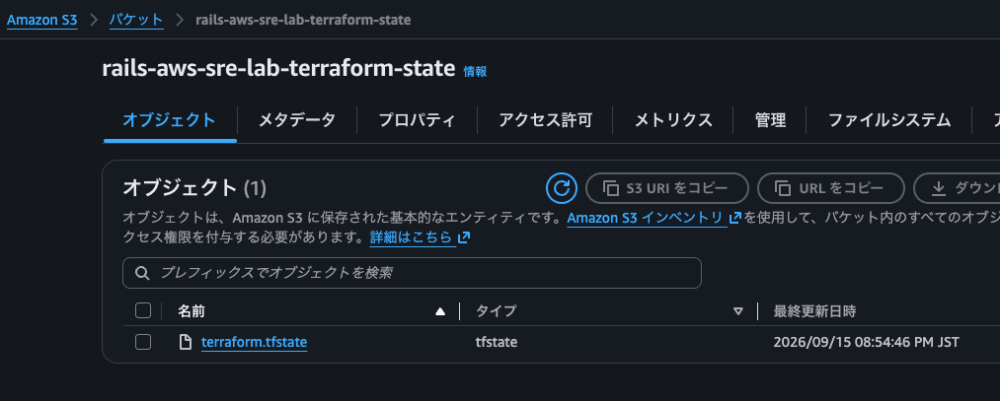
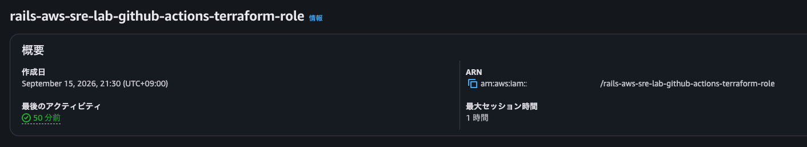
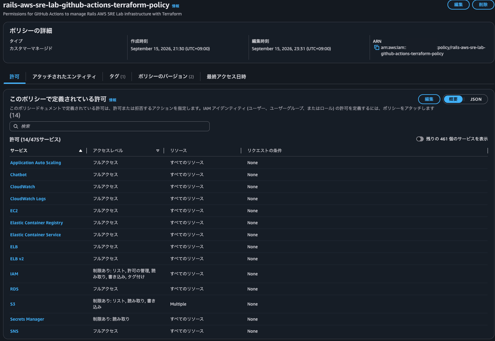
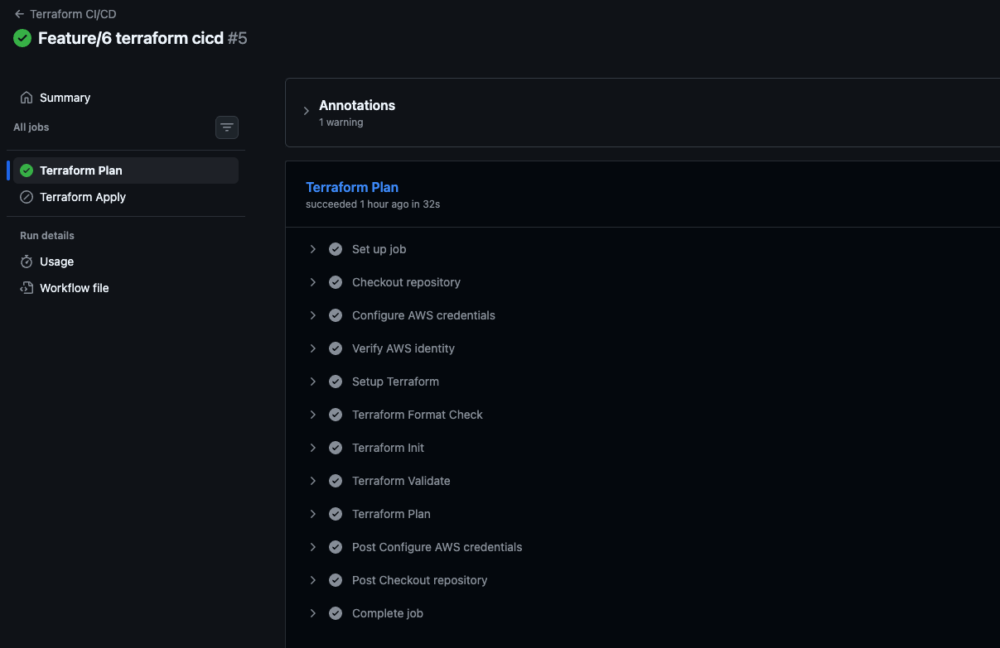
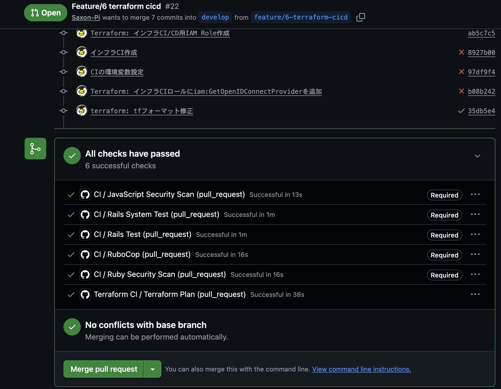
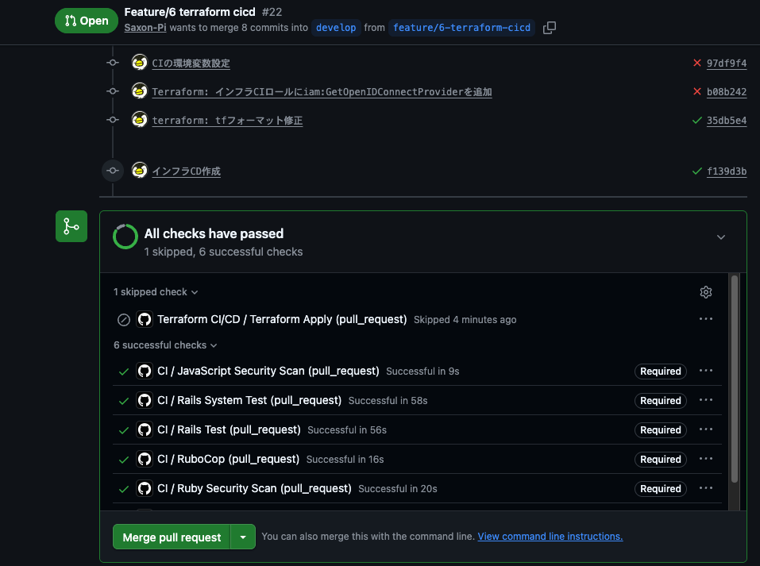

<!-- omit in toc -->
# Terraform Remote State / CI/CD

<!-- omit in toc -->
## 目次

- [概要](#概要)
- [1. Remote State](#1-remote-state)
- [2. GitHub Actions から AWS への認証](#2-github-actions-から-aws-への認証)
- [3. Terraform CI](#3-terraform-ci)
- [4. Terraform CD](#4-terraform-cd)
- [5. Terraform Variables](#5-terraform-variables)
- [6. 最終フロー](#6-最終フロー)
- [まとめ](#まとめ)

---

## 概要

Terraform の State を S3 Remote Backend へ移行し、  
GitHub Actions + OIDC を利用したインフラ CI/CD を構築した

PR では Terraform のフォーマット・構成・変更内容を検証し、  
`develop` ブランチへのマージ後に Terraform Apply を実行する

``` text
feature branch
    |
    | Pull Request
    v
GitHub Actions
    |
    ┝─ terraform fmt -check
    ┝─ terraform init
    ┝─ terraform validate
    ┝─ terraform plan
    |
    | Required Status Check
    v
develop へ Merge
    |
    | push
    v
GitHub Actions
    |
    ┝─ OIDC -> IAM Role
    ┝─ terraform init
    ┝─ terraform apply
    |
    v
AWS Infrastructure
```

---

## 1. Remote State

Terraform State をローカル管理から S3 Remote Backend へ移行した

-   Backend: Amazon S3
-   State: `terraform.tfstate`
-   State Lock: S3 Lockfile
-   `terraform.tfstate` は Git 管理しない



`terraform init` で Backend を初期化し、  
以降の `plan` / `apply` では Remote State を利用する

State Lock により、GitHub Actions とローカル環境などから  
Terraform が同時実行された場合の State 競合を防止する

``` text
terraform apply
    |
    ┝─ Lock取得: terraform.tfstate.tflock
    ┝─ AWSリソース変更
    ┝─ terraform.tfstate 更新
    └─ Lock解放
```

---

## 2. GitHub Actions から AWS への認証

GitHub Actions から AWS への認証には OIDC を利用する

Access Key / Secret Access Key のような長期 Credential は GitHub に保存せず、  
OIDC Token を利用して AWS STS 経由で Terraform 用 IAM Role を Assume する

``` text
GitHub Actions
    |
    | OIDC Token
    v
AWS STS
    |
    | AssumeRoleWithWebIdentity
    v
Terraform IAM Role
    |
    v
AWS Resources
```

Terraform 用 Role は Application Deploy Role と分離している



Terraform は VPC、ECS、ALB、RDS、IAM、CloudWatch など複数のインフラリソースを  
作成・変更・削除するため、Application CD より強い権限を必要とする



実運用では Trust Policy の Repository / Branch / Environment 制限や、  
IAM Policy の最小権限化が重要となる

---

## 3. Terraform CI

Terraform 関連ファイルを変更した Pull Request で Terraform CI を実行する

``` yaml
pull_request:
  branches:
    - develop
    - main
  paths:
    - "terraform/**"
    - ".github/workflows/terraform.yml"
```

CI では以下を実行する

``` text
terraform fmt -check -recursive
        |
terraform init -input=false
        |
terraform validate
        |
terraform plan -input=false -no-color
```



| 処理 | 目的|
| --- | --- |
| `terraform fmt -check` | Terraform コードが標準フォーマットになっていることを確認 |
| `terraform init`       | Provider / Module / Remote Backend を初期化 |
| `terraform validate`   | Terraform 設定の構文や参照関係を検証 |
| `terraform plan`       | State・AWS実環境・Terraformコードを比較し、変更予定を確認 |

`Terraform Plan` を GitHub Ruleset の Required Status Check に設定し、  
CI が正常終了していない Terraform 変更をマージできないようにする



---

## 4. Terraform CD

Terraform CD は Pull Request では実行せず、`develop` への push 時のみ実行する

``` yaml
if: github.event_name == 'push' && github.ref == 'refs/heads/develop'
```



通常の開発フローでは、  
feature branch の Pull Request が `develop` にマージされた結果として  
push イベントが発生し、Terraform Apply が実行される

``` text
Pull Request
    |
    ┝─ Terraform Plan  -> Run
    ┝─ Terraform Apply -> Skip
    |
    v
Merge
    |
    v
develop push
    |
    └─ Terraform Apply -> Run
```

CD では以下を実行する

``` text
Checkout
    |
OIDC Authentication
    |
terraform init
    |
terraform apply -input=false -auto-approve
    |
AWS Infrastructure
```

**マージ後**

-   `develop` push をトリガーに Terraform Apply が起動した画面
-   `Terraform Apply` の Successful ログ
-   Apply 後の対象 AWS リソース
-   Apply 後の `terraform plan` が `No changes` となること

``` text
PR: Plan Successful
        ↓
Merge
        ↓
develop: Apply Successful
        ↓
terraform plan: No changes
```

---

## 5. Terraform Variables

ローカルでは Git 管理対象外の `terraform.tfvars` から値を渡す

GitHub Actions Runner にはこのファイルが存在しないため、  
GitHub Repository Variables と Terraform の `TF_VAR_*` 環境変数を利用する

``` text
GitHub Repository Variables
    |
    ┝─ TF_VAR_slack_workspace_id
    └─ TF_VAR_slack_channel_id
              |
              v
GitHub Actions env
              |
              v
Terraform
              |
              ┝─ var.slack_workspace_id
              └─ var.slack_channel_id
```

これにより、Terraform リソース側のコードを実行環境ごとに変更する必要がない

``` hcl
slack_team_id    = var.slack_workspace_id
slack_channel_id = var.slack_channel_id
```

機密情報については Repository Variables ではなく GitHub Secrets や  
AWS Secrets Manager 等を利用する

---

## 6. 最終フロー

``` text
Developer
    |
    | Terraform変更
    v
Feature Branch
    |
    | Pull Request
    v
GitHub Actions - Terraform CI
    |
    ┝─ OIDC Authentication
    ┝─ terraform fmt -check
    ┝─ terraform init
    ┝─ terraform validate
    ┝─ terraform plan
    |
    | Required Status Check
    v
Review / Merge
    |
    v
develop
    |
    | push
    v
GitHub Actions - Terraform CD
    |
    ┝─ OIDC Authentication
    ┝─ terraform init
    ┝─ terraform apply
    |
    v
AWS Infrastructure
    |
    v
S3 Remote State Update
```

---

## まとめ

Terraform の State を S3 で共有し、  
GitHub Actions から OIDC を利用して AWS インフラを CI/CD できる構成にした

Pull Request では `terraform plan` によって変更内容を事前確認し、  
Required Status Check を通過した変更のみマージ可能とする  

マージ後は `develop` への push を契機として `terraform apply` を実行する

これにより、  
**Terraform変更 → Plan → Review → Merge → Apply → Remote State更新**  
までを一連のインフラ変更フローとして自動化した

---
