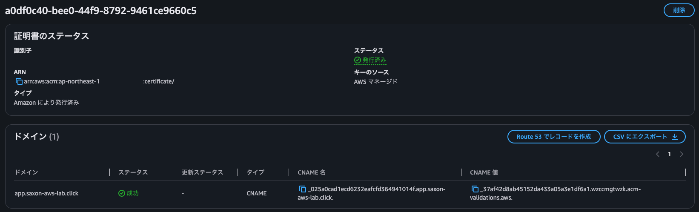
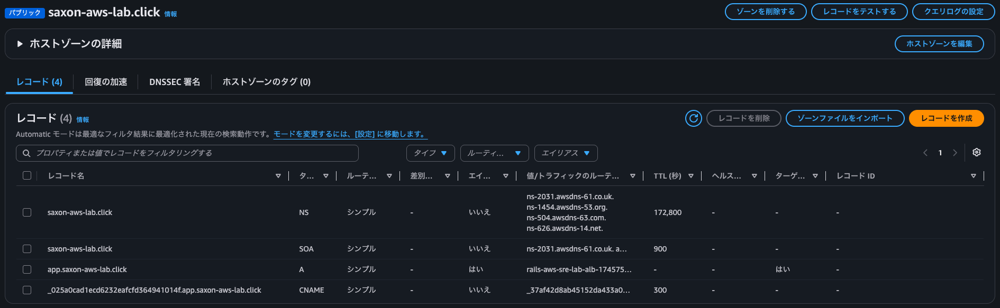
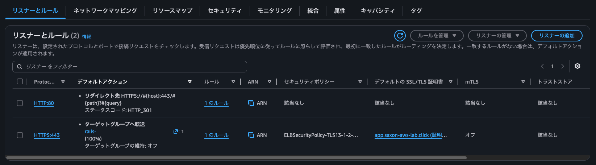
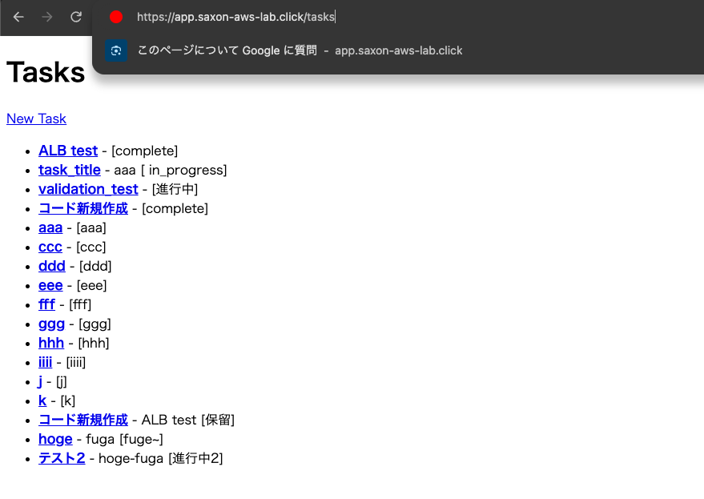
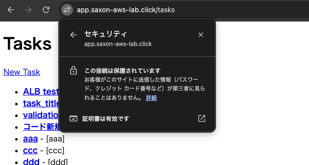
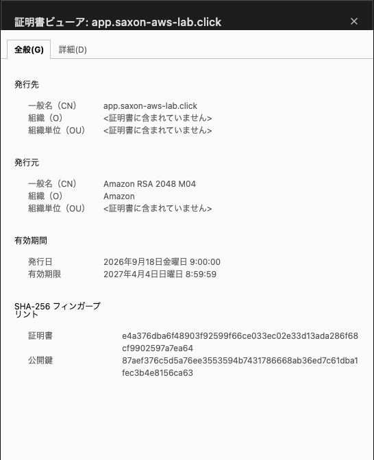

<!-- omit in toc -->
# Security / Availability

<!-- omit in toc -->
## 目次

- [1. 概要](#1-概要)
- [2. Route 53](#2-route-53)
- [3. DNSの仕組み](#3-dnsの仕組み)
- [4. ACM](#4-acm)
- [5. HTTPS](#5-https)
- [6. HTTP → HTTPS Redirect](#6-http--https-redirect)
- [7. 動作確認](#7-動作確認)

---

## 1. 概要

Railsアプリへのアクセスを、ALB の DNS名を利用した HTTP通信から、  
Route 53 + ACM を利用した独自ドメインの HTTPS通信へ変更する

### Before

```text
Browser
↓ HTTP :80
ALB
↓ HTTP :8080
ECS / Rails
```

### After

```text
Browser
↓
https://app.saxon-aws-lab.click
↓ DNS 名前解決
Route 53
↓
ALB :443
↓ TLS 終端（ACM）
↓ HTTP :8080
ECS / Rails
```

---

## 2. Route 53

### ドメイン

`saxon-aws-lab.click`

Route 53 でドメインを取得し、Public Hosted Zone を作成した

Hosted Zone 自体は Terraform 管理対象とはせず、  
Data Source から既存 Hosted Zone を参照している

```hcl
data "aws_route53_zone" "main" {
  name         = "saxon-aws-lab.click"
  private_zone = false
}
```

### A Alias

app.saxon-aws-lab.click の接続先として ALB を指定する

```text
app.saxon-aws-lab.click
↓ A Alias
ALB
↓
ALB に到達可能な IPアドレス
```

ALB の IPアドレスは固定ではないため、  
IPアドレスを直接 Aレコードへ登録せず、ALB を Alias Target して指定する

---

## 3. DNSの仕組み

### NS

NS（Name Server）は、その DNSゾーンを担当する権威DNSサーバーを示す

```text
.click
↓
saxon-aws-lab.click の NS
↓
Route 53
```

### SOA

SOA（Start of Authority）は、
DNSゾーンの管理・同期に関する基本情報を保持する

---

## 4. ACM

app.saxon-aws-lab.click 用の ACM証明書を作成する

```hcl
resource "aws_acm_certificate" "app" {
  domain_name       = "app.saxon-aws-lab.click"
  validation_method = "DNS"
}
```

### DNS Validation

ACM が発行した検証用 CNAME を Route 53 へ登録する

```text
ACM
↓
DNS 検証用 CNAME を発行
↓
_xxxxx.app.saxon-aws-lab.click
↓ CNAME
_xxxxx.acm-validations.aws
↓
ACM が DNS を確認
↓
Certificate ISSUED
```

これにより、申請者が対象ドメインを管理できることを確認する

---

## 5. HTTPS

ALB に HTTPS Listener を追加し、ACM証明書を設定する

```text
Client
↓ HTTPS :443
ALB
↓
ACM Certificate
↓
TLS termination
↓ HTTP :8080
ECS Task
```

Client - ALB 間は TLS で暗号化される

ALB - ECS Task 間は Private Network 内で HTTP通信とする

---

## 6. HTTP → HTTPS Redirect

HTTP :80 へのアクセスは HTTPS :443 に 301 Redirect する

```text
http://app.saxon-aws-lab.click
↓
ALB :80
↓ 301 Redirect
https://app.saxon-aws-lab.click
↓
ALB :443
↓
ECS / Rails
```

## 7. 動作確認

Terraform Apply 後に以下を確認する

- ACM Certificate が発行されている



- Route 53にA Alias と ACM 検証用 CNAME が作成されている



- ALB に HTTPS :443 Listener が存在する



- HTTP アクセスが HTTPS に Redirect され、https://app.saxon-aws-lab.click/tasks にアクセスできる







---
