<!-- omit in toc -->
# Incident Response 検証

<!-- omit in toc -->
## 目次

- [1. 目的](#1-目的)
- [2. シナリオ 1: Rails アプリケーションエラー](#2-シナリオ-1-rails-アプリケーションエラー)
- [3. Scenario 2: ECS Task Failure](#3-scenario-2-ecs-task-failure)
- [4. Observability改善](#4-observability改善)
- [5. 検証結果](#5-検証結果)
- [6. 次の検証](#6-次の検証)

---

## 1. 目的
- 障害の検知・通知・原因分析・復旧までを検証
- 手動 RCA（根本原因分析）のベースラインを作成
- 後続のAWS DevOps Agent との比較に利用

---

## 2. シナリオ 1: Rails アプリケーションエラー

### 障害注入
GET /test-error  
→ Rails RuntimeError  
→ HTTP 500  

```ruby
class HelloController < ApplicationController
  def error
    raise "Intentional test error"
  end
end
```

```bash
curl -i https://app.saxon-aws-lab.click/test-error
HTTP/2 500
```

---

### 検知
HTTPCode_Target_5XX_Count  
→ CloudWatch Alarm  
→ Slack通知  

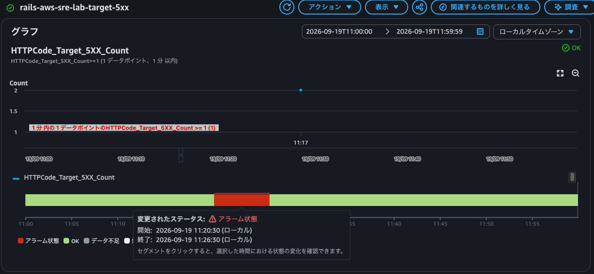

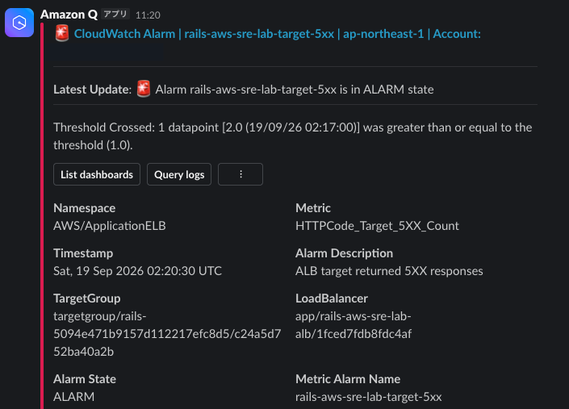


### 原因分析
CloudWatch Logs  
→ status=500  
→ /test-error  
→ Request ID  
→ HelloController#error  
→ RuntimeError  
→ hello_controller.rb:9  

CloudWatch でエラーを検索

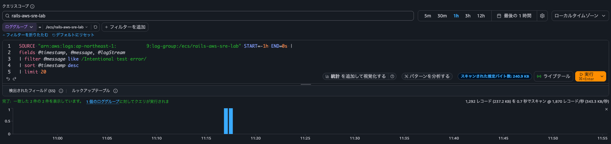

検索結果のログを確認

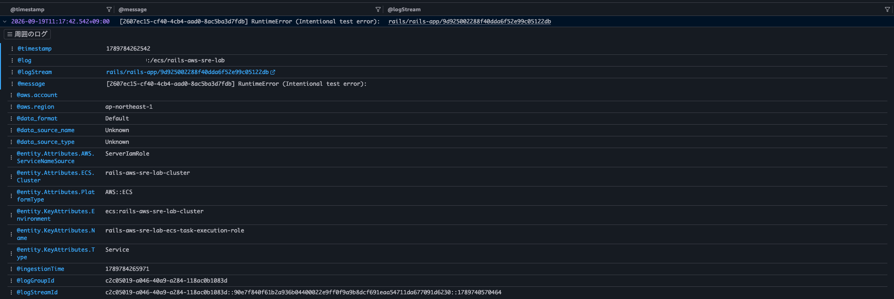

同時刻帯のログを確認

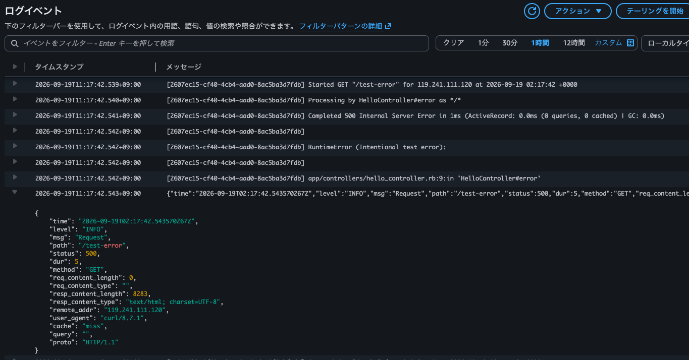

ECS Task からもログを確認

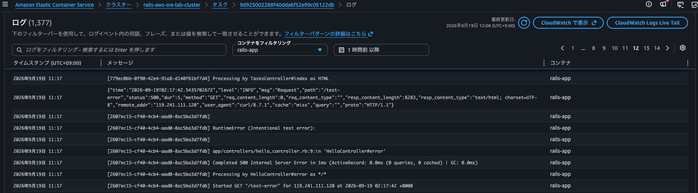

### 復旧確認
GET /tasks  
→ HTTP 200  
→ Alarm OK  


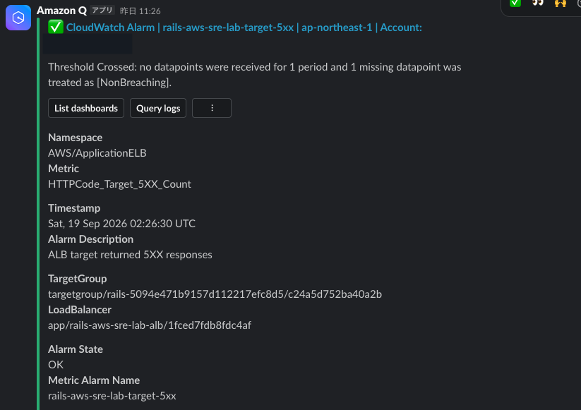

---

## 3. Scenario 2: ECS Task Failure

### 障害注入
ECS Task を手動停止

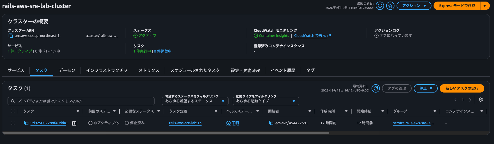

### ユーザー影響
GET /tasks  
→ HTTP 503  
→ server: awselb/2.0  

```bash
curl -i https://app.saxon-aws-lab.click/tasks
HTTP/2 503 
server: awselb/2.0
date: Sat, 19 Sep 2026 08:07:34 GMT
content-type: text/html
content-length: 162

<html>
<head><title>503 Service Temporarily Unavailable</title></head>
<body>
<center><h1>503 Service Temporarily Unavailable</h1></center>
</body>
</html>
```

### 検知
HTTPCode_ELB_5XX_Count  
→ CloudWatch Alarm  
→ Slack通知  

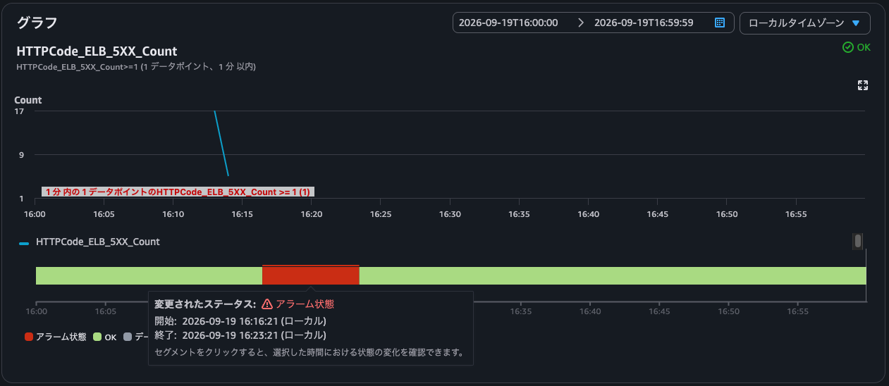

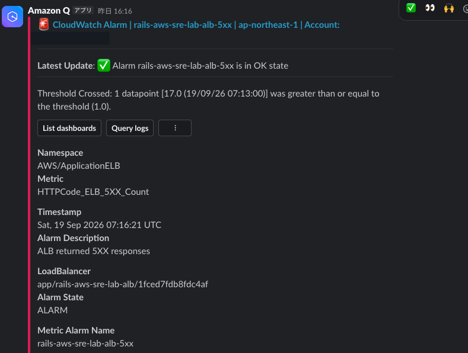

### 原因分析
ECS イベントを CloudWatch Logs に出力することで Task 停止の原因やステータスを確認した

```text
08:07:10 StopTask  
↓
UserInitiated

08:07:19 TaskCreated
↓
Replacement Task

08:07:19 PROVISIONING
↓
08:07:51 RUNNING / ACTIVATING
↓
08:08:46 SERVICE_STEADY_STATE
```

ユーザ操作によって ECS Task が停止したことが確認できる

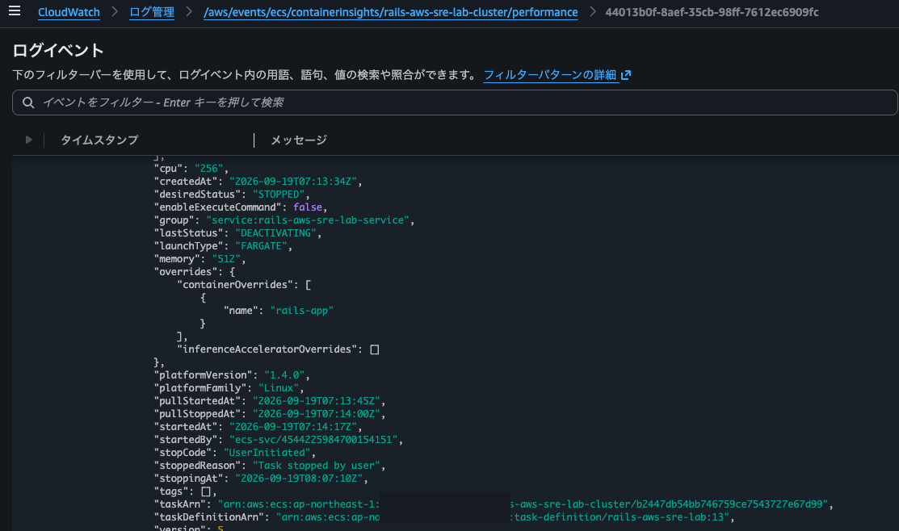

代わりの Task が起動し、復旧したことが確認できる

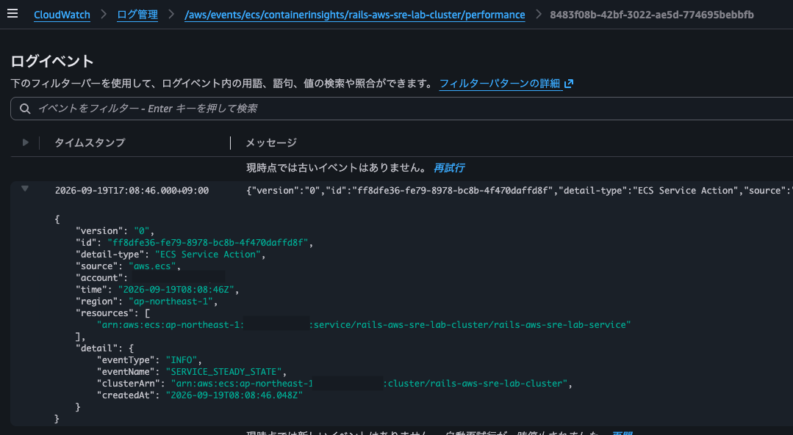

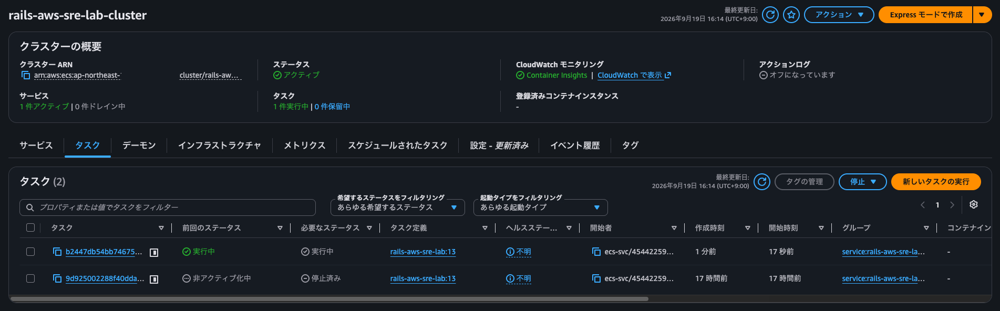

### 復旧確認
GET /tasks  
→ HTTP 200  
→ Alarm OK  

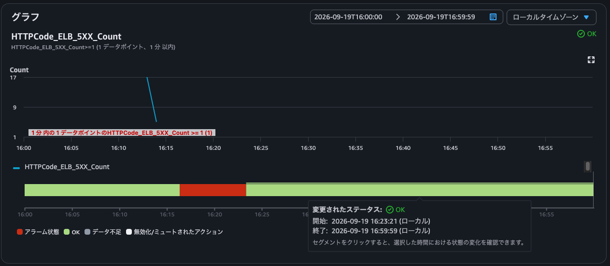

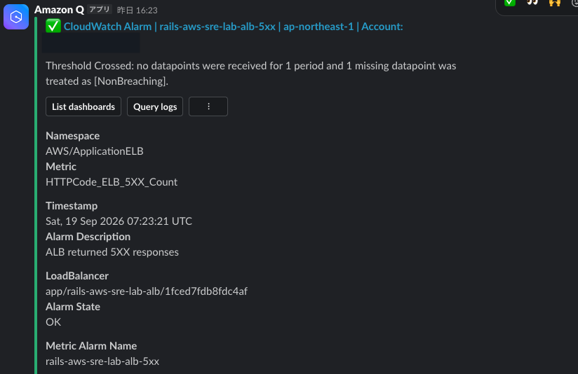

---

## 4. Observability改善

課題:  
ECS イベントの「イベントキャプチャ」が未設定だったため、  
Task/Service の状態遷移を事後確認できなかった

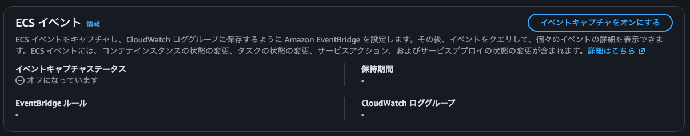

対応:  
`ecs_events.tf` を追加  
（コンソールでイベントキャプチャの有効化はせず、ECS イベントをログ出力する仕組みを構築）

```text
ECS  
 ↓  
EventBridge  
 ↓  
CloudWatch Logs  
```

結果:  
Task State Change / Service Action 等を時系列で確認可能になった

---

## 5. 検証結果

Application Error  
→ Target 5XX から Rails ログを追跡可能

Infrastructure Failure  
→ ELB 5XX と ECS Events から追跡可能

ECS Service  
→ Task 停止後に自動復旧

DesiredCount=1  
→ Replacement Task が Healthy になるまで 503 が発生する

---

## 6. 次の検証

- AWS DevOps Agent を導入し、同様の障害について自律 RCA を実施する
- 手動 RCA vs Agent RCA を比較する

---
