<!-- omit in toc -->
# AWS DevOps Agent インシデント調査検証

<!-- omit in toc -->
## 目次
- [1. 目的](#1-目的)
- [2. 検証環境](#2-検証環境)
- [3. 検証方針](#3-検証方針)
- [4. Scenario 1: Rails HTTP 500](#4-scenario-1-rails-http-500)
- [5. Scenario 2: ECS Task Stop](#5-scenario-2-ecs-task-stop)
- [6. 検証結果比較](#6-検証結果比較)
- [7. 人間による RCA との比較](#7-人間による-rca-との比較)
- [8. DevOps Agent に任せられそうな作業](#8-devops-agent-に任せられそうな作業)
- [9. 人間（SRE）が判断すべき作業](#9-人間sreが判断すべき作業)
- [10. 今回確認できた制約・改善ポイント](#10-今回確認できた制約改善ポイント)
- [11. SRE 運用への組み込み案](#11-sre-運用への組み込み案)
- [12. 導入検討時の評価ポイント](#12-導入検討時の評価ポイント)
- [13. 検証結果](#13-検証結果)
- [14. 今後の検証](#14-今後の検証)

---

## 1. 目的

AWS DevOps Agent を利用し、  
インシデント発生時の調査・根本原因分析（RCA）・緩和策の提示をどこまで自律化できるか検証する

本検証では、先に人手によるインシデント対応をした Rails on ECS 環境に対して、  
同等の障害を再現し DevOps Agent に症状のみを伝えて調査を依頼する

特に以下の観点で評価する

- 症状から対象システムと影響範囲を特定できるか
- Metrics / Logs / CloudTrail / AWS リソース状態などを横断して調査できるか
- 仮説と観測事実を分離し、原因候補を除外できるか
- 根本原因を証拠付きで特定できるか
- Agent が調査できなかった範囲（調査ギャップ）を明示できるか
- 緩和策、事前確認、事後確認、ロールバックまで提示できるか
- 人手による調査と比較して、SRE の調査トイルをどこまで削減できるか

---

## 2. 検証環境

### 2.1 アプリケーション構成

```text
Internet
   |
Route 53
   |
ALB :443
(TLS termination)
   |
Target Group :8080
   |
ECS Fargate
Thruster :8080
   |
Puma :3000
   |
Rails
   |
RDS PostgreSQL
```

主な構成は以下

| 項目 | 構成 |
| --- | --- |
| Application | Ruby on Rails |
| Container | ECS Fargate |
| Load Balancer | Application Load Balancer |
| Database | Amazon RDS for PostgreSQL |
| Logs / Metrics | Amazon CloudWatch |
| Audit | AWS CloudTrail |
| IaC | Terraform |
| ECS desiredCount | 1 |
| RDS | Single-AZ |

---

### 2.2 DevOps Agent

Agent Space に AWS アカウントを Primary source として関連付け、  
チャット形式のアプリケーションから調査を実行する

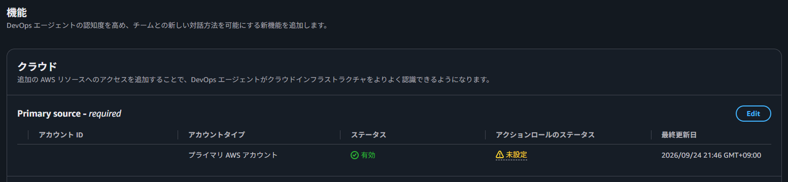

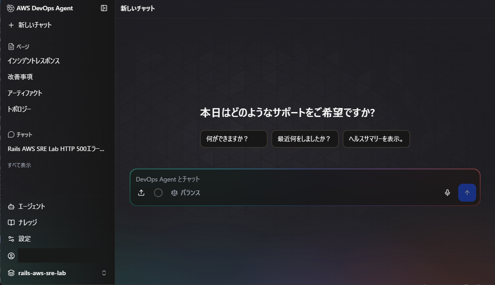

Agent Space を作成すると Topology Mapping が自動生成され、  
rails-aws-sre-lab 環境は ECS / ALB / RDS / ECR などから構成される論理システムとして認識された

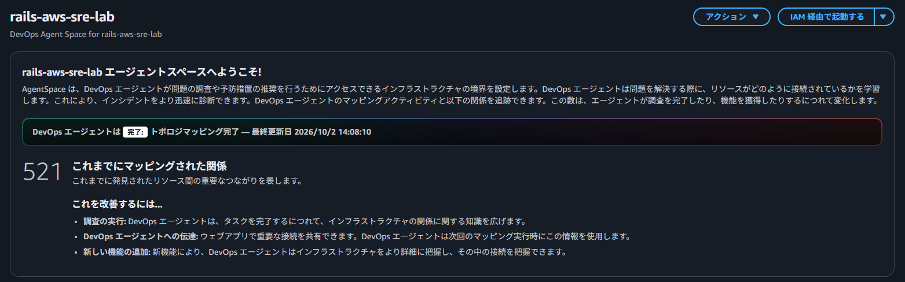

自動生成された Topology：

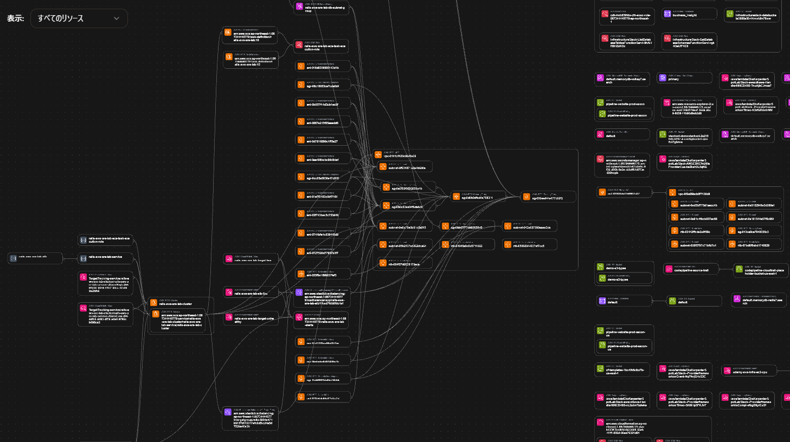

本検証では Elevated Role（Agent によるリソースの操作権限）を設定せず、  
DevOps Agent の役割を以下に限定する

```text
DevOps Agent
  ├─ 調査
  ├─ 根本原因の分析
  ├─ エビデンスの収集
  └─ 緩和計画の提案

SRE（人間）
  ├─ エビデンスの確認
  ├─ 緩和計画の確認
  ├─ リスクアセスメント
  └─ 修正内容の決定 / 実行
```

---

## 3. 検証方針

今回の検証では DevOps Agent に障害原因を直接伝えず、  
利用者が観測できる「症状」だけを入力して、原因調査を依頼する

これにより、Agent が Topology と Telemetry から自律的に原因へ到達できるかを評価する

---

### 評価観点

| 観点 | 確認内容 |
| --- | --- |
| Scoping | 対象システム・影響範囲を正しく特定できるか |
| Telemetry | Metrics / Logs / Events を横断できるか |
| Hypothesis | 仮説を立て、反証できるか |
| RCA | 根本原因を証拠付きで特定できるか |
| Gap | 調査不能な情報を明示できるか |
| Mitigation | 緩和策・恒久対策を提示できるか |
| Safety | Prepare / Validate / ロールバック を考慮できるか |
| Time | Investigation 完了までの時間 |

---

## 4. Scenario 1: Rails HTTP 500

### 4.1 障害内容

Rails に検証用エンドポイント `/test-error` を用意し、  
アクセス時に意図的な `RuntimeError` を発生させる

- routes.rb
```ruby
Rails.application.routes.draw do
  ...
  get "/tasks", to: "tasks#index"
  get "/test-error", to: "hello#error"
end
```

- hello_controller.rb
```ruby
class HelloController < ApplicationController
  ...

  def error
    raise "Intentional test error"
  end
end
```

curl コマンドで、まずは正常系を確認する

```bash
curl -I https://app.saxon-aws-lab.click/tasks
```

実行結果：

```text
HTTP/2 200
```

続いて curl コマンドで異常系を確認する

```bash
curl -i https://app.saxon-aws-lab.click/test-error
```

実行結果：

```text
HTTP/2 500
x-request-id: f47924c7-5978-415f-91ff-8fc1afb0a282
```

---

### 4.2 Agent への入力

Agent には事象のみを伝えて、原因調査を依頼する

> Rails AWS SRE LabでHTTP 500エラーが発生しました。原因を調査してください。

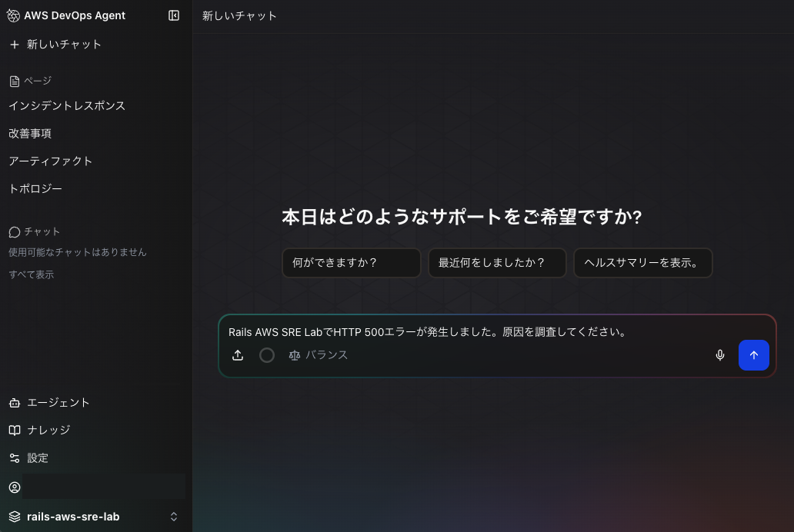

調査方法は「インベスティゲーションを開く」を選択し、  
バックグラウンドで Agent に自律的な調査をさせる

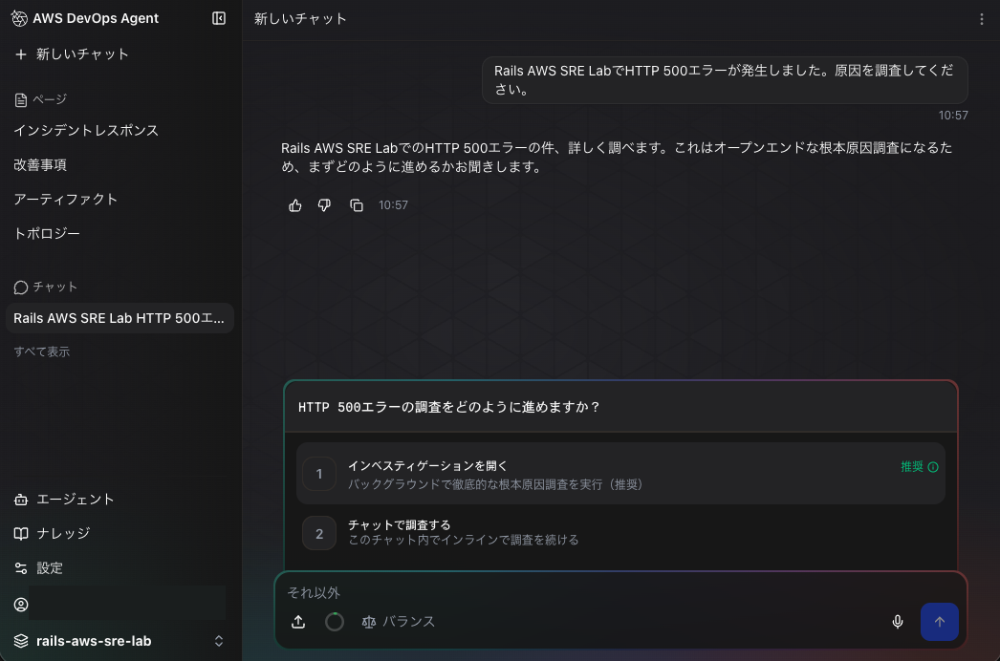

---

### 4.3 調査の流れ

DevOps Agent は Topology Mapping から rails-aws-sre-lab の構成を読み込み、  
CloudWatch Alarm / Metrics / Logs / AWS リソース状態などを調査した

調査結果を整理すると以下の流れとなる

```text
HTTP 500
   |
   v
Target 5XX を確認
   |
   ├─ ALB 5XX = 0
   |      -> ALB 自身のエラーではない
   |
   ├─ ECS / ALB / RDS health
   |      -> リソースはすべて正常
   |
   ├─ Resource saturation
   |      -> CPU / DB / latency に異常なし（即時応答）
   |
   ├─ Deployment / infrastructure change
   |      -> 同時間帯のAWS側の変更は確認されず、変更起因の可能性は低い
   |        （リポジトリ未接続のためコード差分までは確認できず）
   v
CloudWatch Logs
   |
   v
GET /test-error
   |
   v
HelloController#error
   |
   v
app/controllers/hello_controller.rb:9
   |
   v
RuntimeError: Intentional test error
```

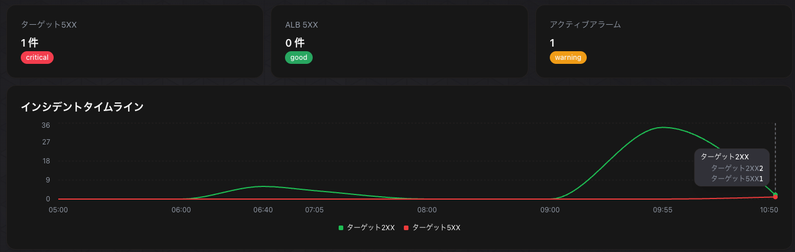

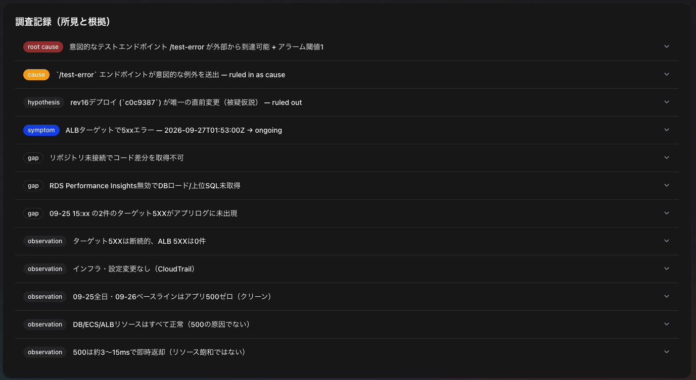

---

### 4.4 根本原因

DevOps Agent は以下を根本原因として特定した

```text
/test-error
   -> HelloController#error
   -> RuntimeError (Intentional test error)
   -> Rails が HTTP 500 を返却
```

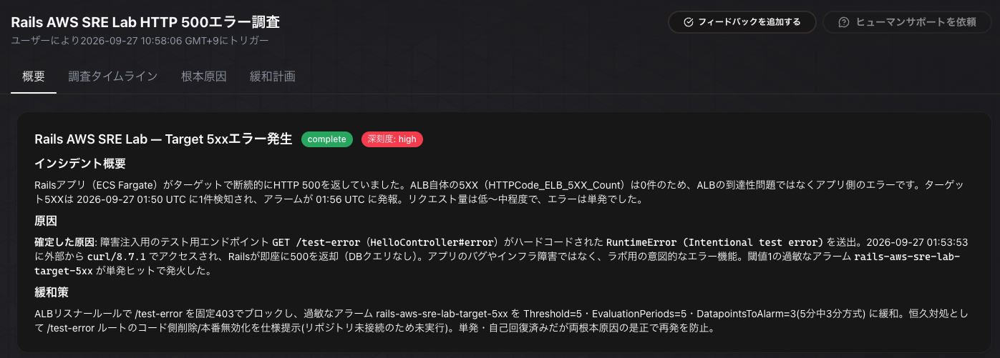

さらに、Target 5XX が発生している一方で ALB 5XX は 0 件であること、  
ECS / ALB / RDS が正常であること、当該リクエストで DB Query が発生していないことなどから、  
インフラや DB を原因候補から除外した

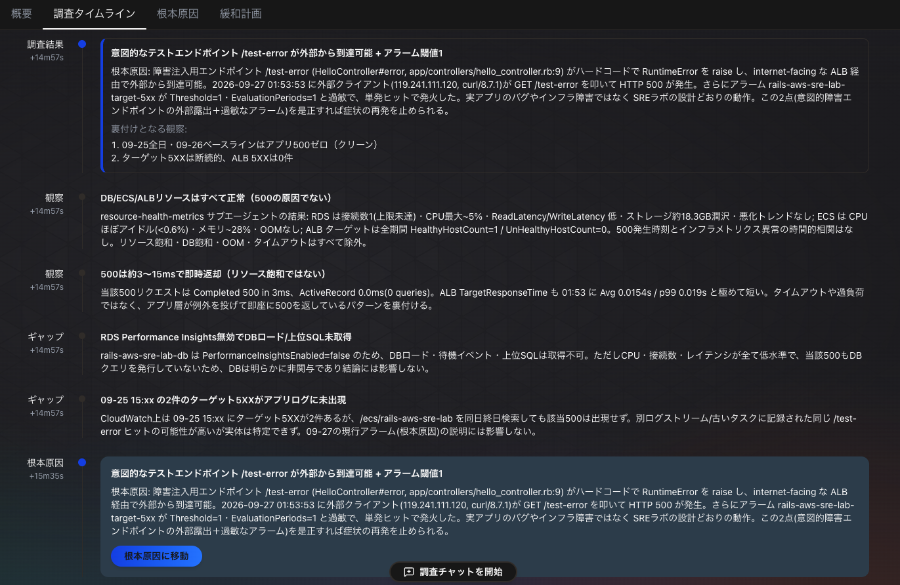

---

### 4.5 調査ギャップ

Agent は調査できなかった範囲も明示した

| Gap | 影響 |
| --- | --- |
| Source Repository 未接続 | コード差分や CI/CD 実行履歴を直接取得できない |
| RDS Performance Insights 無効 | DB Load / Wait Event / Top SQL を取得できない |
| 過去の一部 Target 5XX と現在ログの対応不足 | 過去イベントの詳細原因を断定できない |

今回の 500 については Rails Log から直接原因を確認できたため、  
これらの調査ギャップは、根本原因の結論には影響しなかった

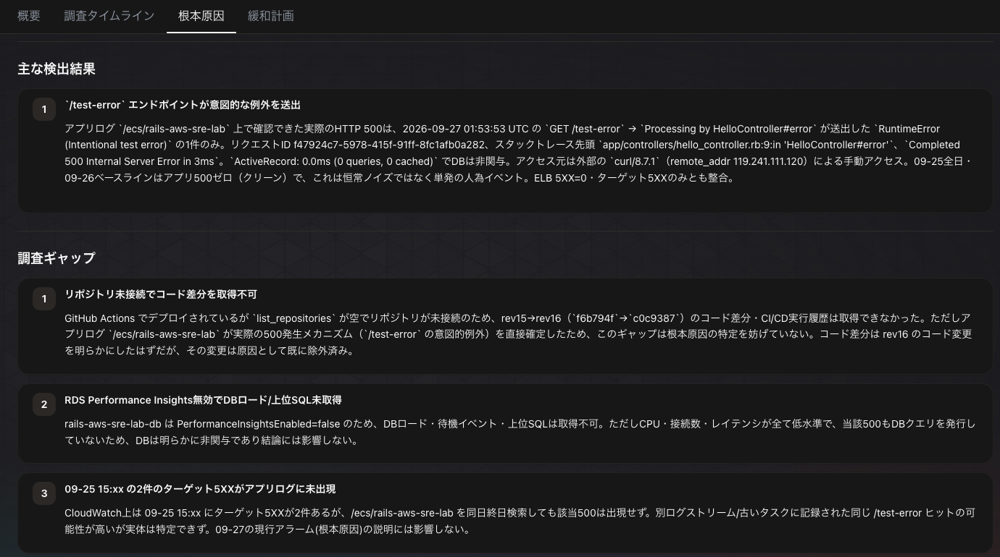

---

### 4.6 緩和計画

DevOps Agent は以下のような対策を提示した

- `/test-error` を ALB Listener Rule で外部から到達不能にする
- 単発 5XX で発報する CloudWatch Alarm の条件を見直す
- 恒久対応として `/test-error` を削除または本番環境で無効化する
- 変更前設定の保存、事前検証、変更後検証、ロールバック 手順を準備する

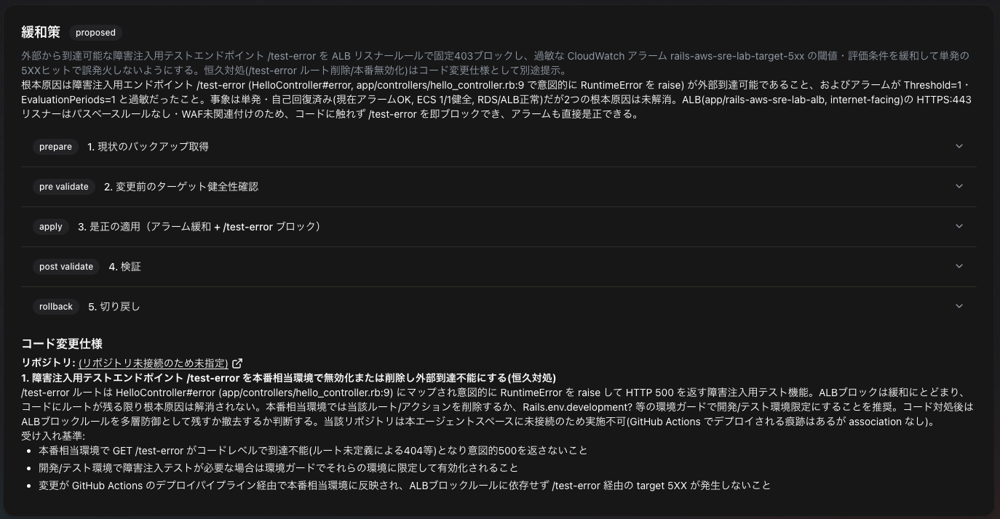

重要なのは、Agent の提案内容をそのまま採用するのではなく、  
Alarm の閾値などは SLO、通常トラフィック、許容エラー率を踏まえて人間が判断することである

また、緩和計画の具体的な手順も提示される

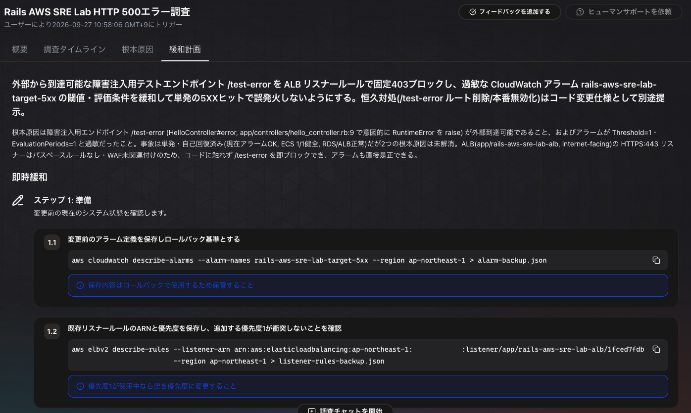

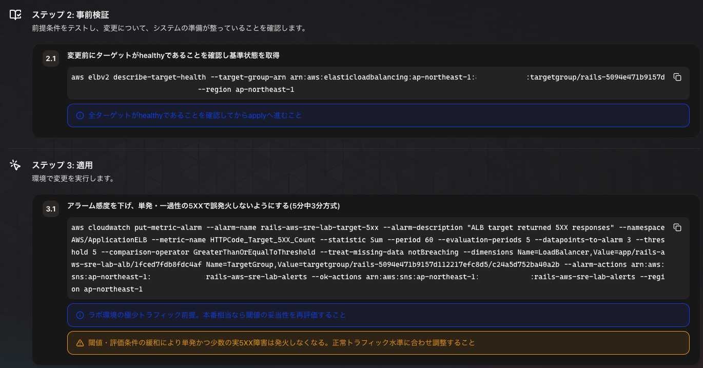

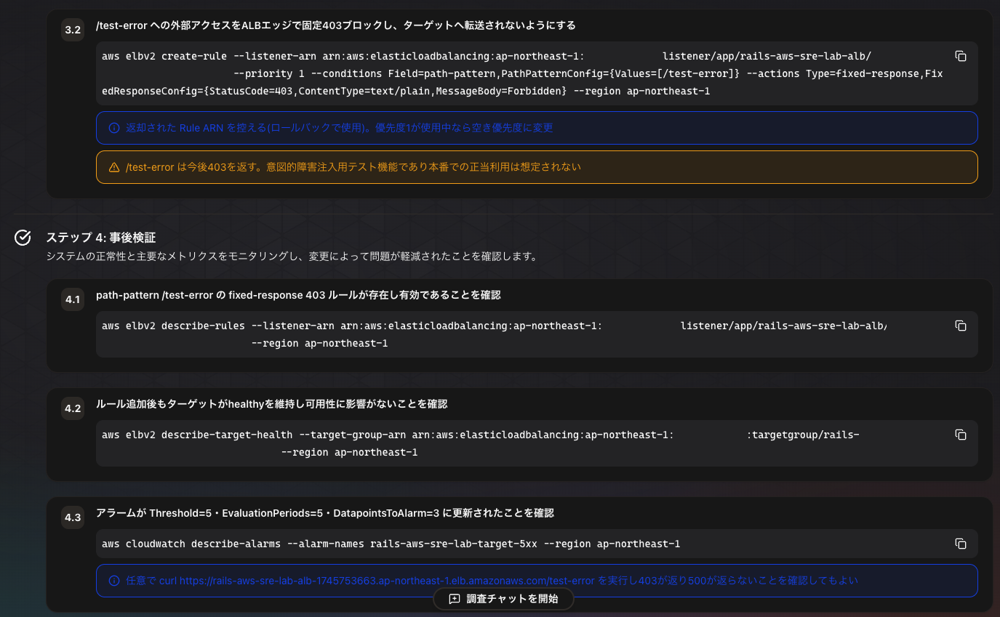

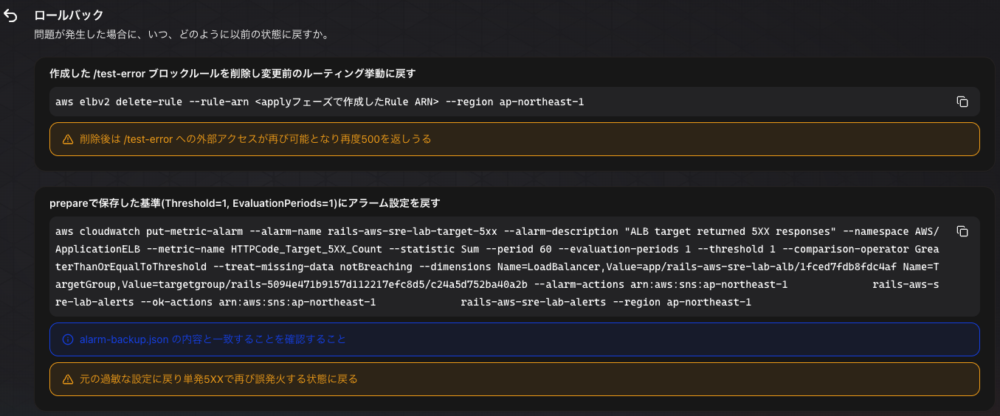

---

### 4.7 調査時間

本シナリオの検証では、  
調査タイムライン上では、根本原因の特定まで約 **15分35秒** 掛かった


---

## 5. Scenario 2: ECS Task Stop

### 5.1 障害内容

稼働中の唯一の ECS Task を AWS Management Console から手動停止し、  
一時的なサービス断を発生させる

※ ECS Service は `desiredCount = 1` で稼働

```text
ECS Service
Desired = 1
Running = 1
    |
    | StopTask
    v
Running = 0
    |
    v
Healthy Target = 0
    |
    v
ALB HTTP 503
    |
    v
ECS Service launches replacement task
    |
    v
Running = 1 / Healthy Target = 1
```

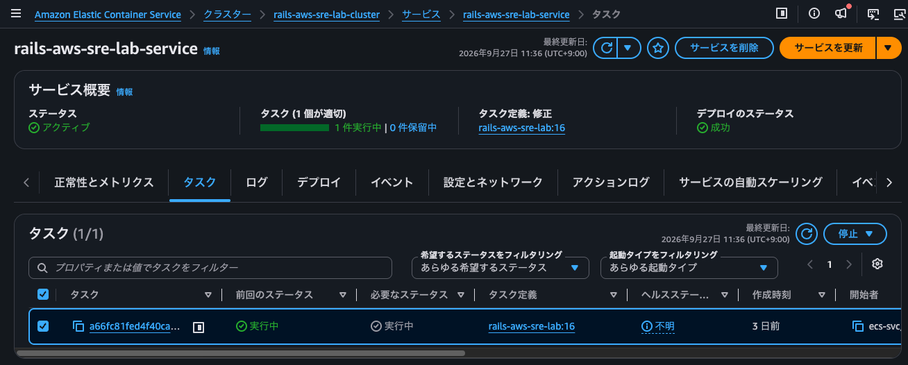

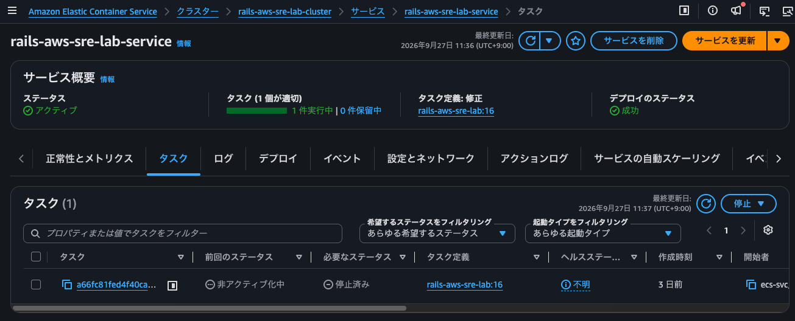

---

### 5.2 Agent への入力

ECS や Task の状態については一切伝えず、ユーザー視点の症状だけを入力した

> https://app.saxon-aws-lab.click/tasks に一時的に接続できなくなったから、原因を調べてみて！

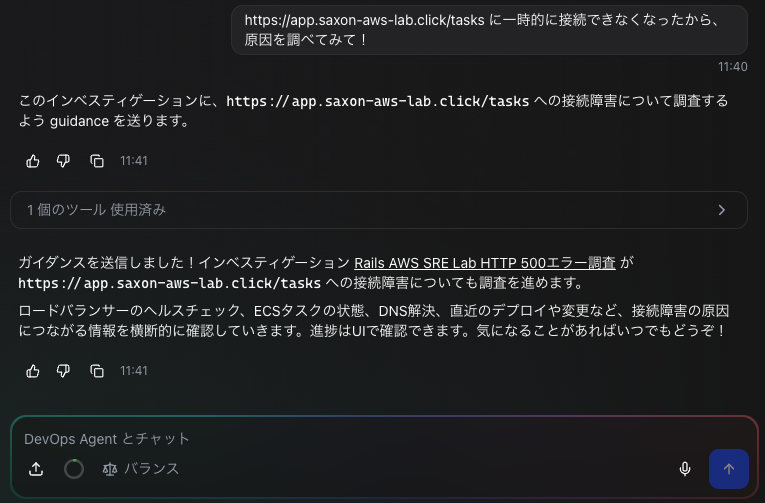

※ Scenario 2 は Scenario 1 と同一の調査コンテキスト上で実施したため、  
Agent は前回調査の情報を参照可能であり、完全に独立した検証ではない  
（障害原因そのものは入力しておらず、根本原因は指示後に CloudTrail / Metrics / Resource State から特定している）

---

### 5.3 Investigation の結果

DevOps Agent は以下を確認した

- `/tasks` への接続障害時間帯を特定
- ALB HTTP 503 が 76 件発生
- HealthyHostCount が一時的に 0
- Rails アプリケーション層の 500 は発生していない
- DNS / Route 53 は正常
- 同時間帯の Deployment / Infrastructure Change はなし
- CloudTrail から `StopTask` API 実行を検出
- ECS Taskの停止情報から `stopCode = UserInitiated` を確認
- ECS Service が Replacement Task を起動
- 約 1〜2 分で Self Healing

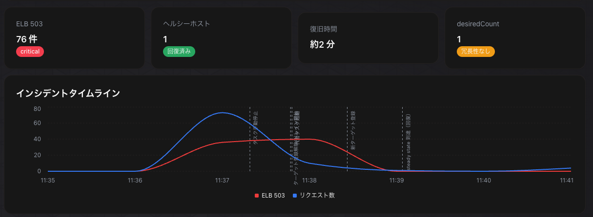

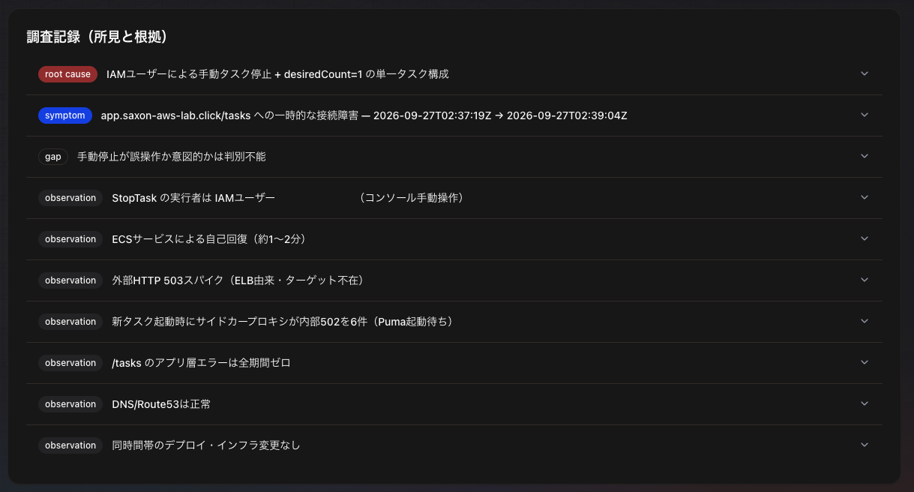

---

### 5.4 根本原因

Agent が確定した因果関係は以下

```text
IAM User / Management Console
        |
        | StopTask
        v
唯一の ECS Task が停止
        |
        | desiredCount = 1
        v
Healthy Target = 0
        |
        v
ALB が HTTP 503 を返却
        |
        v
ECS Service が Replacement Task を起動
        |
        v
Healthy Target = 1
        |
        v
サービス復旧
```

直接原因は `StopTask` による稼働 Task の停止

一方で、1 Task の喪失が即座にサービス断へつながった構造的な要因として、  
`desiredCount = 1` による冗長性不足も指摘している

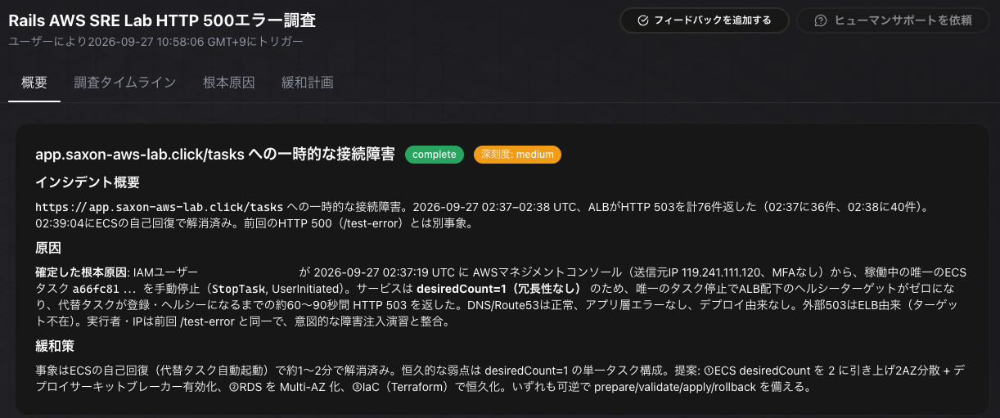

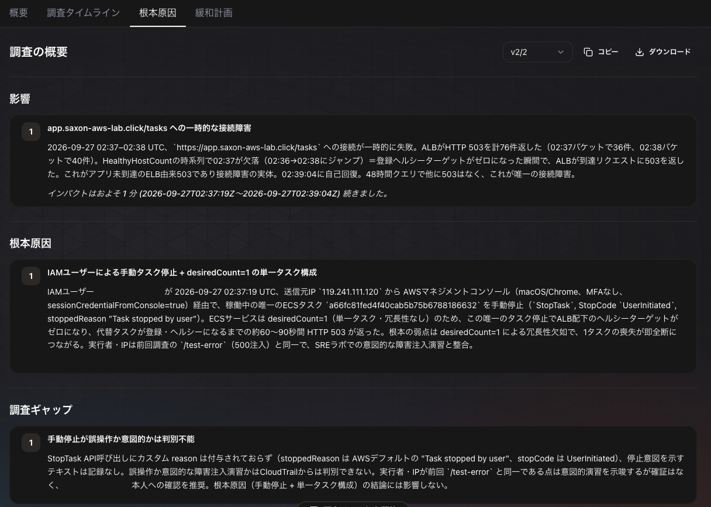

---

### 5.5 ECS の自己回復について

DevOps Agent は、ECS Service によって代替 Task が自動起動され、  
サービスが約 1〜2 分で復旧したことも確認した

今回の構成は ECS の自己回復は機能したが、  
`desiredCount = 1` による冗長性欠如を指摘している

単一 Task 障害時にもサービス継続できる構成に近づけるために、  
`desiredCount = 2` への引き上げと 2AZ分散を推奨している

```text
自己回復（Self Healing）
  = 障害後に正常状態へ自動復旧できる

高可用性（High Availability）
  = 障害中もサービス提供を継続できる
```

---

### 5.6 調査ギャップ

`StopTask` が手動実行されたことは CloudTrail から確認できたが、  
その操作が誤操作なのか意図的な障害試験なのかまでは判別できなかった


このことから、Agent は観測可能な事実と推測を分離していることが分かる

---

### 5.7 緩和計画

Agent は主に以下を提案した

```text
「今回のインシデントの直接的な対策」
→ ECS Task の冗長化・AZ 分散

「周辺のレジリエンス改善」
→ Deployment Circuit Breaker・RDS Multi-AZ

「構成の恒久化」
→ Terraform
```

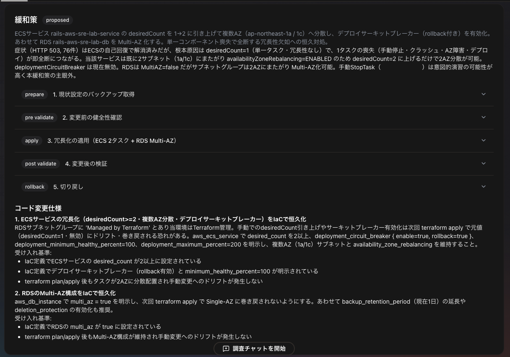

加えて RDS Multi-AZ など、システム全体の可用性改善も提案している

ただし RDS Multi-AZ は今回の ALB 503 の直接的な再発防止ではないため、  
「今回の Incident に対する対策」と「システム全体の可用性改善」は人間側で分離して評価する必要がある

また、緩和計画の具体的な手順も提示される

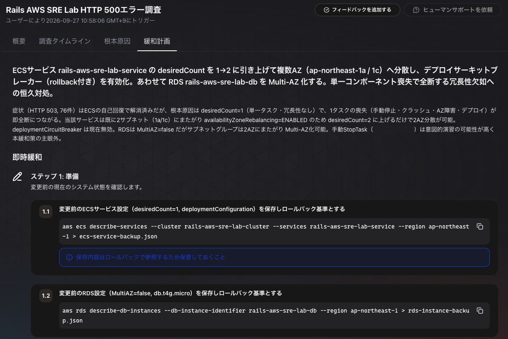

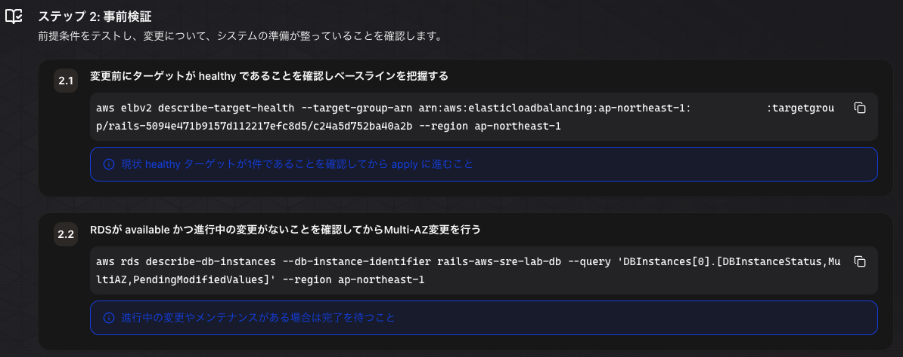

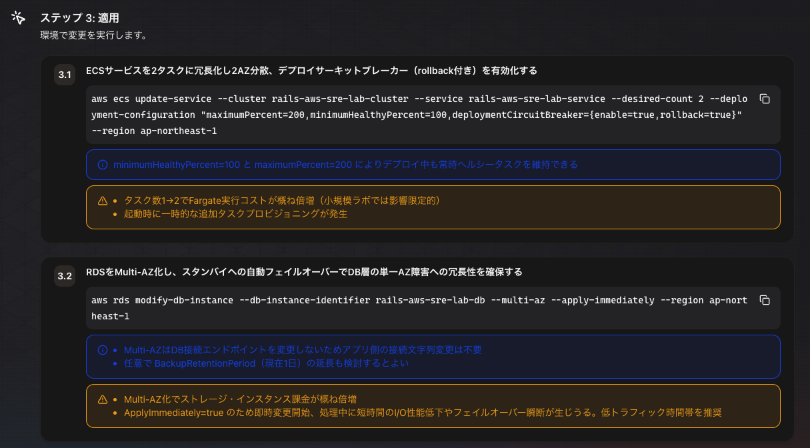

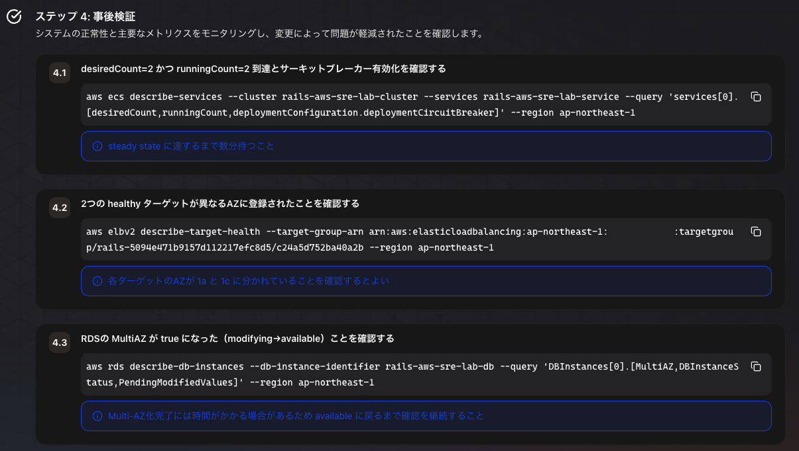

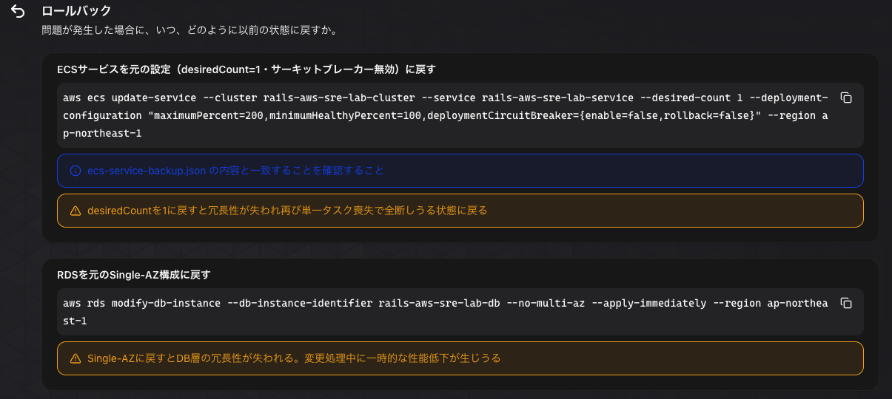

---

### 5.8 調査時間

本シナリオの検証では、  
調査タイムライン上では、根本原因の特定まで約 **10分30秒** 掛かった

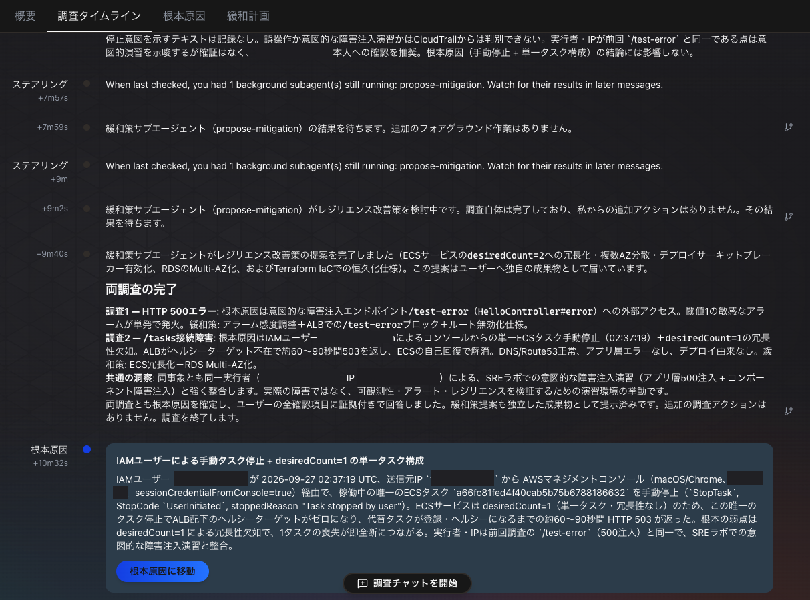

---

## 6. 検証結果比較

| 項目 | Scenario 1 | Scenario 2 |
| --- | --- | --- |
| 障害 | Rails HTTP 500 | ECS Task Stop |
| 種別 | Application | Infrastructure / Availability |
| Agent に与えた情報 | HTTP 500 が発生 | `/tasks` に一時的に接続できない |
| 根本原因 | `RuntimeError` | `StopTask` + `desiredCount=1` |
| Logs | Rails Log を調査 | アプリ 500 がないことを確認 |
| Metrics | Target 5XX / ALB 5XX 等 | ALB 503 / HealthyHostCount 等 |
| Audit | 変更履歴を確認 | CloudTrail `StopTask` を特定 |
| 原因候補の除外 | ALB / ECS / RDS / AWS 側の変更 | DNS / App / Deployment 等 |
| 自己回復 | 対象外 | 代替 Task まで追跡 |
| 調査ギャップ | 明示あり | 明示あり |
| 緩和計画 | あり | あり |
| 調査時間 | 約15分35秒 | 約10分30秒 |
| RCA | 成功 | 成功 |

異なる種類の障害に対して、  
どちらも症状から根本原因の特定まで自律的に到達したことを確認できた

※ Agent の調査時間は、調査開始から調査タイムライン上で根本原因が確定するまでを計測している

---

## 7. 人間による RCA との比較

本検証の前段では、同じ Rails HTTP 500 と ECS Task Stop を人手でも調査した

人手による HTTP 500 の調査フローは概ね以下だった

```text
CloudWatch Alarm（Slack 通知）を確認
   |
   v
Metrics のチェック
   |
   v
Logs Insights によるエラーログの検索
   |
   v
Request ID の特定
   |
   v
Rails Log の調査
   |
   v
Stack Trace
   |
   v
根本原因の特定
```

DevOps Agent は、このような一連の調査に加えて、  
インシデントの影響や調査ギャップ、緩和策、ロールバックの手順までまとめている

今回は人手側は厳密な調査時間を計測していないため、定量的な速度比較は行わないが、  
Scenario 1 では、障害内容を事前に把握した状態で人手調査を行った場合でも、  
ログレベルで原因を確認するまで一定の時間を要した（約10～20分）  

初見のインシデントでは、対象リソースや確認すべき Telemetry の選定から始めるため、  
さらに調査時間が増える可能性がある

今回の結果から、少なくとも初動調査・情報収集・RCA の整理については、  
DevOps Agent に委譲できる範囲が大きいことを確認できた

---

## 8. DevOps Agent に任せられそうな作業

今回の検証では、以下のような調査トイルを Agent が自律的に実行した

```text
インシデント
   |
   v
対象システムの特定
   |
   v
Topology / Telemetry の収集
   |
   ├─ CloudWatch Metrics
   ├─ CloudWatch Logs
   ├─ CloudTrail
   ├─ AWS Resource State
   |
   v
仮説作成
   |
   v
証拠収集 / 反証
   |
   v
根本原因分析
   |
   ├─ 裏付けとなる証拠
   ├─ 調査ギャップ
   |
   v
緩和計画
   |
   ├─ ステップ 1: 準備
   ├─ ステップ 2: 事前検証
   ├─ ステップ 3: 適用
   ├─ ステップ 4: 事後検証
   └─ ロールバック
```

従来、人間が複数の AWS Console や Logs Insights を行き来して実施していた調査を、  
一つの調査報告として整理できる点は大きい

---

## 9. 人間（SRE）が判断すべき作業

DevOps Agent が RCA と改善案を提示できたとしても、  
その内容をそのまま運用判断として採用すべきではない

例えば今回の提案でも、以下は人間側で判断が必要だった

- Alarm Threshold の変更が SLO やトラフィック特性に対して妥当であるか
- `desiredCount = 2` による可用性向上とコスト増のバランス
- RDS Multi-AZ が今回のインシデント対策として必要か
- 提案された緩和計画の方法が Terraform の Source of Truth と整合するか
- 本番環境で変更を実行しても問題ないか
- ビジネスへの影響と変更リスクのどちらを優先するか

したがって、現時点で想定する役割分担は以下となる

```text
DevOps Agent
  調査 / 根本原因の分析 / エビデンスの収集 / 緩和計画の提案
                     |
                     v
SRE（人間）
  分析結果の確認 / 対応の優先度付け / 承認 / 設計の更新
                     |
                     v
システムに実装
```

単純に SRE の仕事を Agent に代替させるというよりも、  
DevOps Agent によって Telemetry の収集や一次分析に費やす時間を減らすことができ、  
人間は設計・リスク評価・意思決定へ集中するための仕組みとして有効であると考える

---

## 10. 今回確認できた制約・改善ポイント

### Source Repository と接続した調査

Source Repository が未接続だったため、Scenario 1 ではコード差分や CI/CD 履歴を取得できなかった

Repository / Pipeline を接続すれば、以下のような調査まで拡張できる可能性がある

```text
Incident
   |
Telemetry
   +
Deployment 履歴
   +
Code 差分
   |
   v
「どの変更がインシデントを引き起こしたか」
```

---

### Database Telemetry

RDS Performance Insights が無効だったため、DB Load / Wait Event / Top SQL は調査できなかった

今回の Scenario では DB が直接原因ではなかったため RCA に影響しなかったが、  
DB Performance Incident を検証する場合は Observability の追加が必要となる

---

### 人間の意図の判断（誤操作か意図的な操作か）

CloudTrail から「誰が・いつ・どの API を実行したか」は確認できても、  
「なぜ実行したか」までは必ずしも判断できない

Agent がこの点を調査ギャップとして明示したことで、推測と事実の分離ができていることが分かる

---

## 11. SRE 運用への組み込み案

今回の検証結果から、以下のインシデント対応フローが考えられる

```text
インシデント発生 / アラート作動
       |
       v
Observability
CloudWatch / New Relic / etc.
       |
       v
AWS DevOps Agent
       |
       ├─ 影響範囲の特定
       ├─ Telemetry 収集
       ├─ 仮説の生成
       ├─ 根本原因の分析
       ├─ 調査ギャップ
       ├─ 緩和計画
       |
       v
SRE（人間）によるレビュー
       |
       ├─ エビデンスは妥当か
       ├─ 調査ギャップは許容できるか
       ├─ 提案は SLO と整合するか
       ├─ 緩和策のリスクやコストは許容できるか
       ├─ IaC と整合するか
       |
       v
意思決定（何を・どのように対策するか）
       |
       v
変更 / 復旧作業
       |
       v
事後検証（変更によって問題が解決されたか）
```

期待できる業務改善は、単に「AI に質問する」ことではなく、  
インシデント発生後の初動調査を Agent に担当させ、人間がレビューと意思決定に集中できることである

特に少人数の SRE / Platform チームでは、  
複数サービスの Telemetry を横断して初動調査する負荷を下げられる可能性がある

---

## 12. 導入検討時の評価ポイント

実業務への導入を判断する場合、今回の成功例だけでなく以下も評価する必要がある

| 評価軸 | 評価ポイント |
| --- | --- |
| Accuracy | 根本原因の特定率、誤った RCA の頻度 |
| Coverage | AWS / Application / DB / External Service のどこまで調査可能か |
| MTTR | 人手運用と比較して検知〜原因特定〜復旧まで短縮できるか |
| Observability | 既存の CloudWatch / New Relic 等を活用できるか |
| Security | Agent Role、Operator Access、Elevated Action の権限設計 |
| Safety | 人間による承認、ロールバック、Agent の変更範囲の制御 |
| IaC | Terraform 等の Source of Truth と整合できるか |
| Cost | Agent 利用料と削減できる運用工数のバランス |
| Auditability | 調査根拠、実行操作、変更履歴を追跡できるか |
| Team Fit | オンコール / インシデント管理のプロセスに組み込めるか |

本番導入前には、  
正常系だけでなく誤検知、複合障害、Telemetry 不足、権限不足などを含めた追加評価が必要となる

---

## 13. 検証結果

今回の 2 Scenario では、  
AWS DevOps Agent はどちらも症状のみの入力から根本原因まで到達できた

```text
Scenario 1
Rails HTTP 500
  -> RuntimeError
  -> Controller / source line
  -> 約15分35秒

Scenario 2
Temporary connection failure
  -> ECS StopTask
  -> Healthy Target = 0
  -> ALB HTTP 503
  -> ECS Self Healing
  -> 約10分30秒
```

また根本原因の提示だけでなく、  
エビデンス収集、調査ギャップ、緩和計画、事後検証、ロールバック まで整理した

本検証から、以下の運用モデルには十分な検討価値があると判断した

```text
インシデント発生
     |
     v
DevOps Agent に調査を依頼
     |
     v
概要 / 根本原因 / エビデンス / 調査ギャップ / 緩和計画を生成
     |
     v
SRE（人間）によるレビュー
     |
     v
具体的な対応を判断
```

人間が一つずつ Metrics / Logs / Events を探索して RCA を組み立てるのではなく、  
Agent が一次調査と RCA を組み立て、人間がその証拠と提案をレビューする

この役割分担により、SRE 担当者は反復的な調査作業を減らし、  
可用性設計、リスク評価、改善施策、意思決定など、より高いレイヤーの仕事へ時間を使える可能性がある

---

## 14. 今後の検証

- Source Repository / CI/CD Integration を追加し、コード差分まで含めた RCA を検証する
- New Relic 等の Observability Platform と接続した場合の調査範囲を確認する
- Database Performance Incident を追加する
- CPU / Memory の飽和などパフォーマンスに起因したインシデントシナリオを追加検証する
- 複数障害が同時発生するシナリオを検証する
- 誤った仮説を Agent が適切に棄却できるか評価する
- Investigation Feedback / Memory による継続的な精度改善を確認する
- Elevated Actions を利用する場合の、人間による承認 / IAM Guardrail を検証する
- Agent 利用コストと MTTR / 運用工数削減効果を比較する

---
